# hx-esp32-cam-fpv
Open source digital FPV system based on esp32cam.
- [x] Fully functional video link
- [x] Mavlink telemetry and RC
- [x] Displayport MSP OSD
- [x] GPIO Joystick
- [x] OSD Menu
- [x] documentation
- [x] test ov5640 sensor
- [x] better diagnostic tools
- [x] write proper format .avi on air and ground (seek support)
- [x] font selection for Displayport OSD
- [x] air unit channel search
- [x] test dual wifi cards performance
- [x] build dual wifi RPI GS
- [x] release prebuilt images and firmware
- [x] **Release v0.1.1**
- [x] HQ DVR mode: 1280x720x30fps(ov5640) recording with maximum quality on air unit, with low framerate transmission to GS
- [x] provide manual for running GS software on Ubuntu
- [x] composite output on RPI GS (PAL/NTSC, support for FPV glasses without HDMI input)
- [x] Joystick pinout compatible with Ruby
- [x] **Release v0.2.1**
- [ ] pairing
- [ ] radxa 3w GS
- [ ] dualboot images
- [ ] **Release v0.3.2**
- [ ] measure latency properly
- [ ] study which components introduce latency
- [ ] Camera OSD elements position configuration
- [ ] telemetry logging
- [ ] telemetry sharing on RPI Bluetooth for Android Telemetry Viewer https://github.com/RomanLut/android-taranis-smartport-telemetry
- [ ] sound recording (esp32s3sense)?
- [ ] digital pan, zoom
- [ ] fisheye correction shader, vignetting correction shader
- [ ] EIS
- [ ] Android GS
- [ ] Meta Quest 2 GS

## Features:
- **esp32/esp32s3 + ov2640**: 640x360 30fps, 640x480 30fps, 800x456 30fps, 800x600 30fps, 1024x576 12fps
- **esp32/esp32s3 + ov2640 with sensor overclocking**: 640x360 40fps, 640x480 40fps, 800x456 40fps
- **esp32s3 + ov5640**: 640x360 30/50fps, 640x480 30/40fps, 800x456 30/50fps, 1024x576 30fps
- HQ DVR Mode: 1280x720 30fps (**esp32s3 + ov5640**) or 1280x720 12fps(**esp32/esp32s3 + ov2640**) recoding with maximum possible quality on Air, low FPS transmission to the ground
- up to 1km at 24Mbps (actual transfer rate is ~4-5Mbps total), 600m at 36Mbps (actual transfer rate is ~5-6Mbps total) (line of sight)
- latency 90-110ms
- bidirectional stream for RC and telemetry 115200 Kbps (for Mavlink etc.)
- Displayport MSP OSD
- on-board and groundstation video recording

**Air unit variants (VTX):**
- **esp32s3sense** with **ov5640** camera **(recommended)**
- **esp32s3sense** with **ov2640** camera
- **esp32cam** with **ov2640** camera

**Ground station variants (VRX):**
- **Radxa Zero 3W** with **rtl8812au** wifi card(s) **(recommended)**
- **Raspberry Pi Zero 2W** ... **Raspberry Pi 4B** with **rtl8812au** or **AR9271** wifi card(s)* 
- GS Software also can be run on x86_64 notebook on Ubuntu or Fedora Linux

# Recommended hardware

Although the project can be compiled for various platforms, the recommended hardware for optimal performance is:
- **VTX:** **Seed Studio XIAO ESP32S3 Sense** with **ov5640** camera, **M12** 120° lens, 2dbi dipole
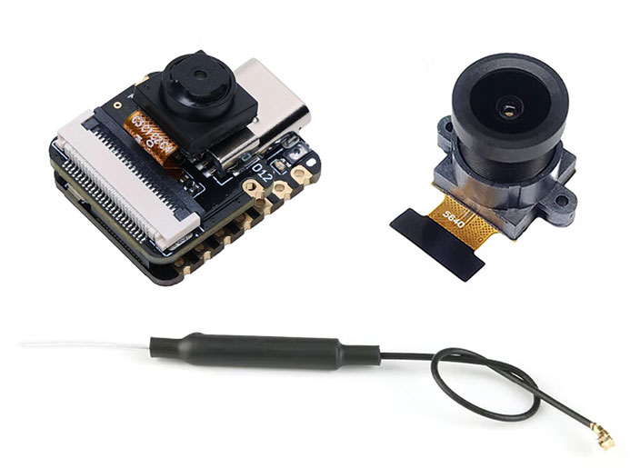

- **VRX:** **Radxa Zero 3W** with dual **rtl8812au** wifi cards, 4x5dBi dipoles
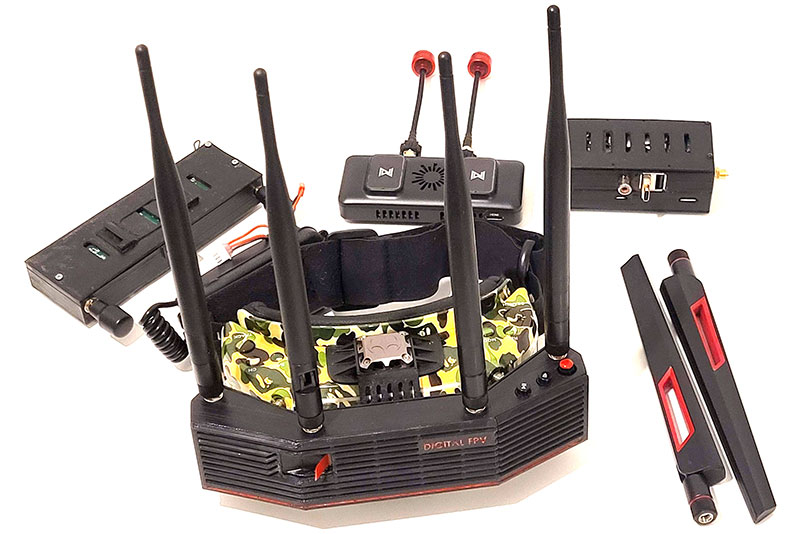

# Theory

Wi-Fi bandwidth is insufficient for uncompressed video streaming, and the **ESP32** lacks the processing power for real-time video encoding. Fortunately, **OV2640/OV5640** camera modules can output frames as JPEG images. This project utilizes that feature to stream MJPEG video.

The camera continuously scans the image sensor and encodes the data row-by-row into JPEG format. These JPEG frames are transmitted to the **ESP32** over I2S at 10 MHz (or 20 MHz for **ESP32-S3** with OV5640), where they are optionally written to an SD card (if DVR mode is enabled), forward error correction (FEC) encoded, and streamed over Wi-Fi.

To reduce latency and memory usage, the esp32-camera component (https://github.com/espressif/esp32-camera) was modified to stream data directly from DMA as it arrives, rather than waiting for full frames. This cuts latency by 10–20 ms and minimizes PSRAM usage. As the camera captures the image, data is already in transmission to the Ground Station (GS).

Wi-Fi packets are transmitted using packet injection, a feature supported by the **ESP32**. FEC (forward error correction)  ensures that the GS can recover from packet loss without needing acknowledgments or retransmissions.

The air unit can also record video directly to an SD card. To compensate for the inconsistent write speeds of SD cards, a 3 MB buffer is used. The recorded video is identical in quality to the streamed version.

JPEG image sizes vary depending on scene complexity. Adaptive JPEG compression dynamically adjusts the quality level to match the available bandwidth and maintain smooth streaming.

The Ground Station can be a **Radxa Zero 3W**, **Raspberry Pi Zero 2W, up to Raspberry Pi 4**, equipped with Wi-Fi cards in monitor mode such as **Realtek 8812AU** (recommended) or **AR9271**. Dual Wi-Fi cards can be used for diversity reception.

**8812au** with a low-noise amplifier (LNA) is preferred; however, a high-power amplifier (PA) is not critical since the range is primarily limited by the **ESP32's** maximum transmit power of 100 mW (20 dBm).

JPEG decoding on the GS is handled by TurboJPEG, achieving decoding times between 1–7 ms depending on resolution. Frames are uploaded as textures and rendered to screen.

On-screen display (OSD) elements are drawn using OpenGL ES.

The link is bi-directional, allowing the Ground Station to send data back to the air unit. Currently, this is used for camera and Wi-Fi configuration, as well as bi-directional telemetry streaming (also FEC encoded).

Here’s an example video captured at 30 FPS, resolution **800×456**, using an **OV2640** sensor with a 120° lens:

https://github.com/RomanLut/esp32-cam-fpv/assets/11955117/970a7ee9-467e-46fb-91a6-caa74871fc3b

# Is it worth building?

**Set your expectations low**. This system begins with a very basic camera — the **OV5640** — comparable to smartphone cameras from around 2005. Using such a sensor means accepting several limitations:
- Noisy image
- Poor brightness/contrast handling, especially in backlit scenes
- Distorted and inaccurate colors
- Weak low-light performance
- Vignetting from cheap lenses
- Blurry corners due to poor focus
- High JPEG compression artifacts

In addition, the **ESP32** lacks hardware video encoding capabilities. As a result, the video stream is transmitted as a series of JPEG images — an inefficient method that wastes bandwidth and reduces potential image quality.

Given its low resolution, **esp32-cam-fpv** should be compared to cheap analog 5.8GHz AIO FPV cameras, not modern digital systems.

What you gain compared to analog AIO systems? For roughly the same price, **hx-esp32-cam-fpv** offers:
- Simultaneous video recording on both air unit and ground station
- Digital OSD
- Mavlink telemetry and RC control
- Telemetry logging
- Clean digital image with no analog interference

Key Drawbacks:
- Blocky JPEG compression
- No Wide Dynamic Range (WDR)
- Distorted color reproduction
- Poor low-light performance (especially with **OV2640**)
- Inconsistent quality between camera units
- Occasional frame drops

**hx-esp32-cam-fpv** is clearly outclassed by all commercial digital FPV systems in terms of image quality.

However, compared to other open-source digital FPV solutions like OpenHD, Ruby, or OpenIPC, it offers:
- low cost air unit
- Very compact size air unit (**XIAO ESP32-S3 Sense**)
- Low power usage (under 300mA at 5V)
- The same ground station hardware used for OpenHD/Ruby/OpenIPC can be reused — just swap the SD card.

# Building

> [!NOTE]
> Please use **release** branch (it contains lastest release). **master** branch can be unstable.

## Air Unit

## Air Unit Variant 1: ESP32CAM

Flashing esp32cam firmware: [/doc/flashing_esp32_cam.md](/doc/flashing_esp32_cam.md)


The **esp32cam** doesn’t have many free pins. You can optionally solder a **REC button** and an additional **REC status LED** where the **Flash LED** normally is. At a minimum, removing the Flash LED is recommended.

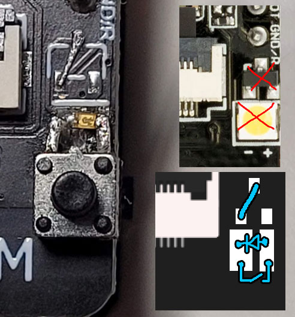

Both internal red LED and additional LED are used for indication:
 * solid - not recording
 * blinking 1Hz - recording
 * blinking 3Hz - OTA update mode.
 
**REC button** is used to start/stop air unit recording. Hold **REC button** on powerup to enter OTA (over the air update) mode.

With pcb antenna, 50m transmission distance can barely be achieved. A jumper has to be soldered to use external antena: https://www.youtube.com/watch?v=aBTZuvg5sM8

## Air Unit Variant 2: **Seed Studio XIAO ESP32 S3 Sense** + OV2640 + M8 120° lens

Flashing **Seed Studio XIAO ESP32 S3 Sense** firmware: [/doc/flashing_esp32s3sense.md](/doc/flashing_esp32s3sense.md)

STL files for 3D Printing on Thingiverse: https://www.thingiverse.com/thing:6624598


 

 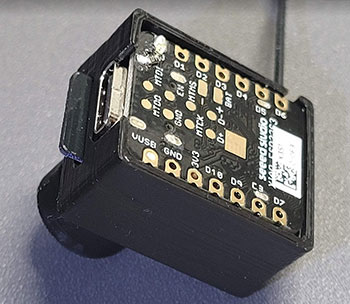

 

Module comes with moderate flexible antenna which should be replaced with 2dBi dipole to maximize range.

Internal yellow LED conflicts with SD card and thus can not be used for indication. External LED should be soldered to pin **D0**.

Existing **Boot** button is used to start/stop air unit recording.

A jumper should be soldered on **J3** to enable SD card usage (somehow it works without it, but is required for stable operation).

## Air Unit Variant 3: **Seed Studio XIAO ESP32 S3 Sense** + OV5640 + M12 120° lens (recommended)

Flashing **Seed Studio XIAO ESP32 S3 Sense** firmware: [/doc/flashing_esp32s3sense.md](/doc/flashing_esp32s3sense.md)

 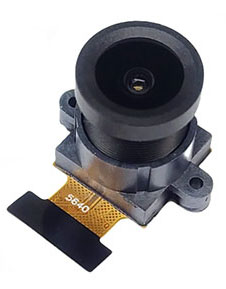

**ov5640** on **esp32s3sense** camera offers 640x360 30/50fps, 640x480 30/40fps, 800x456 30/50fps, 1024x576 30fps and 1280x720 30fps modes, less noisy sensor, much beter colors and contrast, good performance against sunlight.

**es32s3sense** boards are sold with **ov2640** camera which can be easily replaced with **ov5640** purchased separately. No hardware modifications are required for camera replacement.

800x456 30fps MCS3 26Mbps (actual transfer rate ~5Mbps total), **esp32sesense + ov5640** camera 160° lens:

https://github.com/RomanLut/hx-esp32-cam-fpv/assets/11955117/3abe7b94-f14d-45f1-8d33-997f12b7d9aa


STL files for 3D Printing 12mm lens shell on Thingiverse: https://www.thingiverse.com/thing:6646566

## Current consumption

Both **esp32cam** and **esp32s3sense** consume less then 300mA. Flash LED on **esp32cam** board consumes 30mA itself.

---------------------------------------------------------------------------------------------------------------------

## Ground Station

## Ground Station Variant 1: Radxa Zero 3W with dual rtl8812au (Recommended)

Preparing SD Card for **Radxa Zero 3W** GS: [/doc/software_for_radxa.md](/doc/software_for_radxa.md) 

Note: Joystick and keys wiring is compatible with **RubyFPV**. GS built for **RubyFPV** can be used with **hx-esp32cam-fpv** at the same time with dualboot SD Card.

Hold **Air Rec** button on powerup to boot **hx-esp32-cam-fpv** software. Hold **GS Rec** button on powerup to boot **RubyFPV** software. If no buttons are pressed, last software is loaded on reboot.

STL files for 3D printing **Radxa Zero 3W** GS enclosure on Thingiverse: https://www.thingiverse.com/thing:6847533

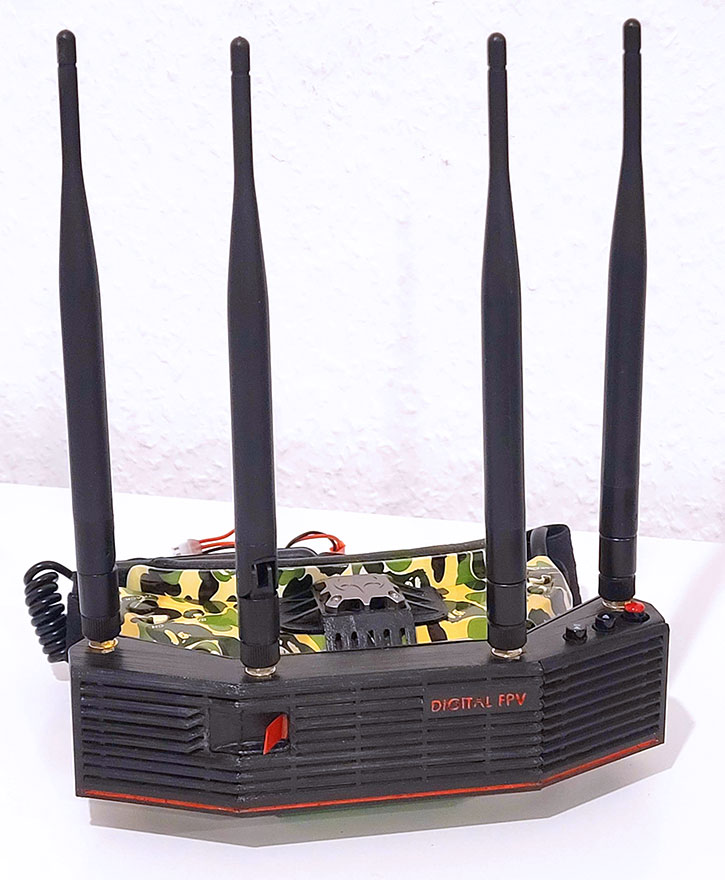
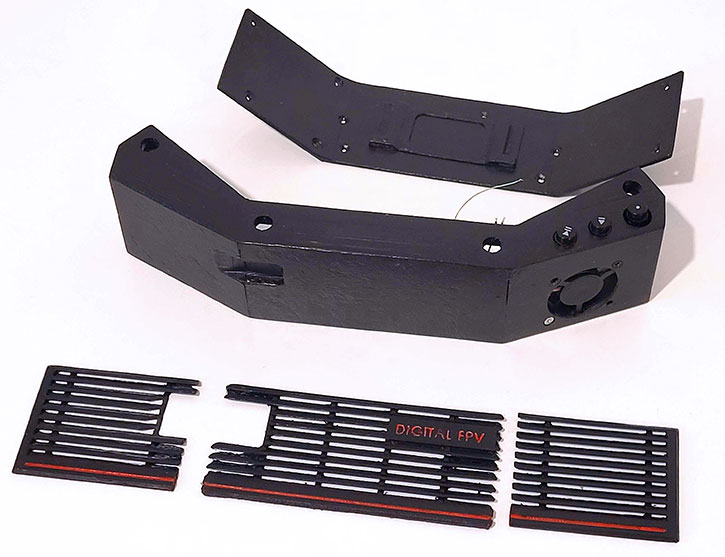
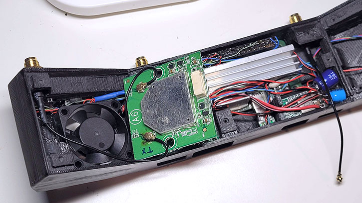
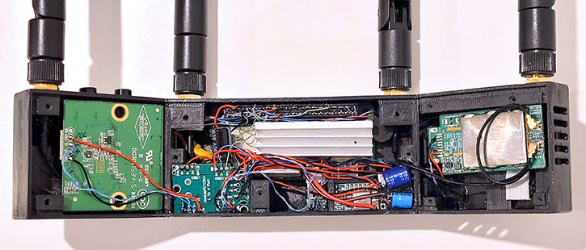

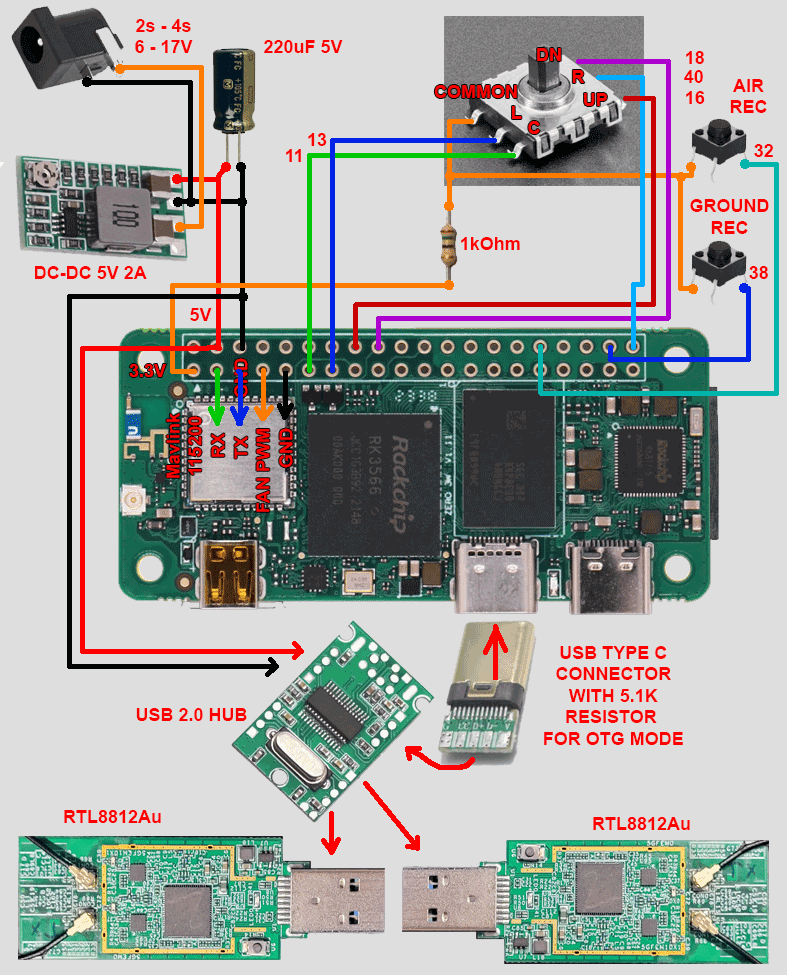

It is highl recommended to install cooling fan 

Radxa Zero 3W pinout for reference: [https://docs.radxa.com/en/zero/zero3/hardware-design/hardware-interface](https://docs.radxa.com/en/zero/zero3/hardware-design/hardware-interface) 

**Bill of materials:**
| Position | Name                             | Quantity |
|----------|----------------------------------|----------|
| 1        | Radxa Zero 3W                    | 1        |
| 3        | DC-DC 5V 2A                      | 1        |
| 3        | DC Female Connector              | 1        |
| 4        | USB Type C OTG Male Connector    | 1        |
| 5        | USB 2.0 HUB                      | 1        |
| 6        | RTL 8812AU                       | 2        |
| 7        | U.fl to SMA Coax Cable           | 4        |
| 8        | 2.4Ghz+5.8Ghz Dipole Antena      | 4        |
| 9        | 4-Position Joystick              | 1        |
| 10       | Button                           | 2        |
| 11       | Resistor 1kOhm                   | 1        |
| 12       | 25x25x8mm Fan                    | 1        |
| 13       | Fan PWM Control board (optional) | 1        |
| 14       | USB Female Connector (optional)  | 2        |


## Ground Station Variant 2: Raspberry PI Zero 2W, Single rtl8812au (Not recommended)

Preparing SD Card for **Raspberry PI GS**: [/doc/software_for_rpi.md](/doc/software_for_rpi.md)

Single wifi card is Ok for the GS with attached small HDMI monitor.

Note: Joystick and keys wiring is compatible with **RubyFPV**. GS built for **RubyFPV** can be used with **hx-esp32-cam-fpv** by swapping SD card.

STL files for 3D printing **Raspberry Pi Zero 2W GS** enclosure on Thingiverse: https://www.thingiverse.com/thing:6624580

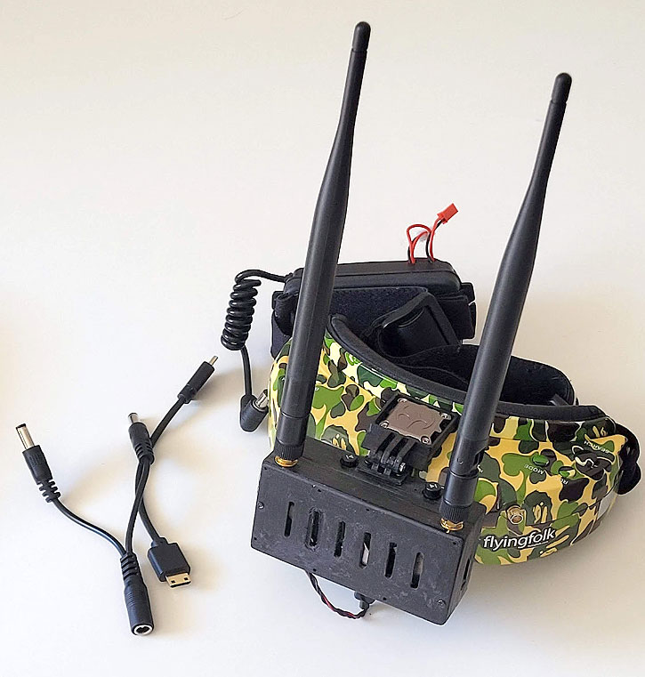


***Note that Raspberry Pi GS is not actively developed and tested. It might be dropped in future releases.***


## Ground Station Variant 3: Raspberry PI Zero 2W, Dual rtl8812au (Not recommended)

Preparing SD Card for **Raspberry PI GS**: [/doc/software_for_rpi.md](/doc/software_for_rpi.md)

Dual wifi cards variant benefit better reception and less frame dropping.

STL files for 3D printing **Raspberry Pi Zero 2W GS** enclosure on Thingiverse: https://www.thingiverse.com/thing:6624580

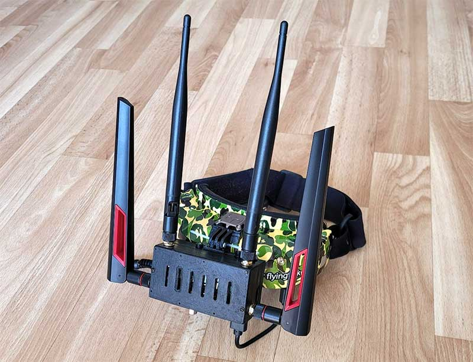


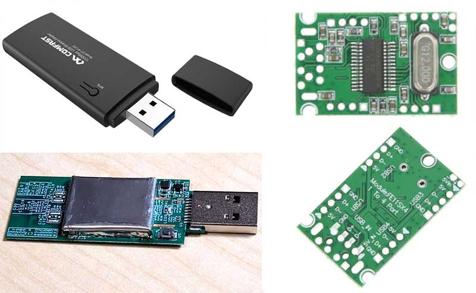

A small USB 2.0 hub board is used to connect two wifi cards and add two USB port sockets. 

Small **rtl8812au** cards are used. 

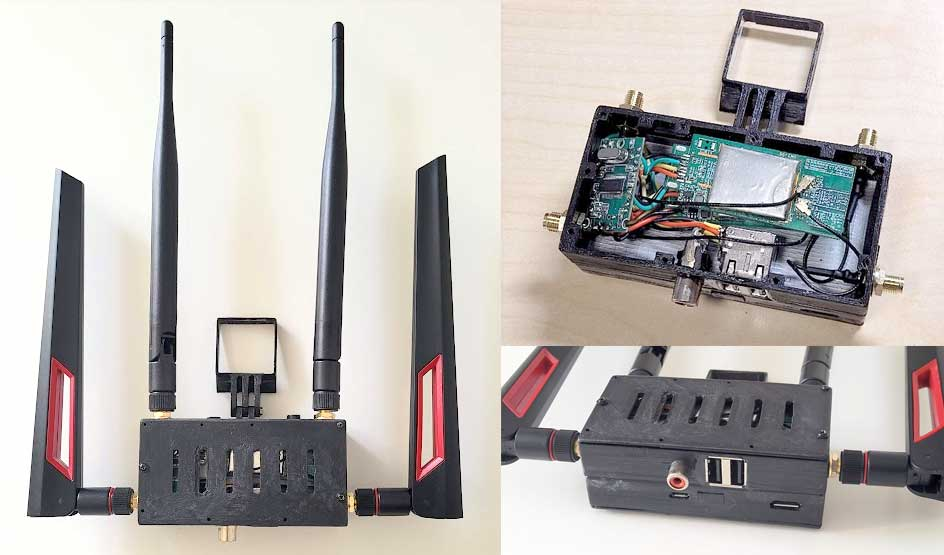

Note that red/black antenas are not recommented unless all you want is to look cool :) These are 2dbi wideband antenas. A pair of 2.4Ghz BetaFPS Moxons with 90° adapters are recommended instead.


***Note that Raspberry Pi GS is not actively developed and tested. It might be dropped in future releases.***


## Ground station Variant: Ubuntu

Building and running Ground Station software on a Ubuntu desktop (x86_64 notebook, Raspberry Pi 4 or Radxa Zero 3W): [/doc/running_gs_on_ubuntu.md](/doc/running_gs_on_ubuntu.md)


## Ground station Variant: Fedora Linux Workstation

Building and running Ground Station software on a Fedora Linux Workstation (x86_64 notebook): [/doc/running_gs_on_fedora.md](/doc/running_gs_on_fedora.md)


# Displayport MSP OSD

 Configure Displayport MSP OSD 115200, Avatar in INav/Betaflight/Ardupilot.

 A number of OSD fonts are included. User fonts can be placed in ```/gs/assets/osd_fonts/``` - 24 pixels wide png format.
 
https://github.com/RomanLut/hx-esp32-cam-fpv/assets/11955117/42821eb8-5996-4f39-aac6-2929c9d3661e


# Mavlink

 Can be used for RC and for downlink telemetry. Setup baudrate 115200 for the UART. 
 
 This is transparent bidirectional stream sent with FEC encoding (Ground2Air: ```k=2 n=3```, Air2Ground: Same as video stream, ```k=6 n=12``` by default).

# Camera OSD Elements


From left to right:
 - ```AIR:-10``` Air Unit RSSI in Dbm
 - ```GS:-14:-13``` GS RSSI in Dbm on each wifi card
 - Average wifi queue usage. Should be below 50%. Look for free wifi channel if it turns red frequently
 - actual MJPEG stream bandwidth in Mbps (without FEC encoding). Wifi stream bandwwith = MJPEG stream bandwidth * FEC_n / FEC_k (2x for FEC 6/12)
 - resolution
 - FPS at GS
 - ```!NO PING!``` Indicates that air unit does not receive GS packets (configuration packets, uplink Mavlink)
 - ```AIR``` Air unit is recording video to SD card
 - ```GS``` GS is recording video to SD card
 - ```HQ DVR``` HQ DVR mode enabled
 - ```!SD SLOW!``` SD card on AIR unit is too slow to record video, frames are skipped
 - ```OFF``` Camera is stopped by RC cahnnel
 - ```Air: 112°``` Air unit temperature exceeded 110° (overheat)
 - ```GS: 90°``` GS CPU temperature exceeded 80° (overheat). Throttling and degraded performance may occur.
   
# OSD Menu


OSD Menu can be navigated with **GPIO Joystick**, keyboard or mouse.

Key                                                    | Function
------------------------------------------------------ | -------------
Joystick Center, Enter, Right Click                    | Open OSD menu
Joystick Right, Air REC, GS REC,Esc, Right Click, R, G | Close OSD Menu
Joystick Center, Joytsick Right, Enter, Left Click     | Select menu item
Joystick Up, Arrow Up                                  | Select previous menu item
Joystick Down, Arrow Down                              | Select next menu item
Joystick Left, Arrow Left, ESC                         | Exit to previous menu

# GPIO Joystick button mapping

GPIO Joystick and buttons are mapped to keys.

Key                   | Function
--------------------- | -------------
Joystick Center       | Enter
Joystick Left         | Arrow Left
Joystick Right        | Arrow Right
Joystick Up           | Arrow Up
Joystick Down         | Arrow Down
AIR REC               | r
GROUND REC            | g


# Other keys

Key                   | Function
--------------------- | -------------
Space                 | Exit application
ESC                   | Close OSD menu or exit application
d                     | Open Development UI


# Considerations

## Resolution

**OV2640**

**esp32cam** and **esp32s3sence** boards come with the **OV2640** sensor by default. 

The sweet spot settings for this camera seems to be 800x600 resolution with JPEG compression level in range 8…63 (lower is better quality). 30 fps is achieved. Additionaly, custom 16:9 modes 640x360 and 800x456 are implemented. Personally I like 800x456 because 16:9 looks more "digital" :)

Another options are 640x480 and 640x360, which can have better JPEG compression level set per frame, but luck pixel details and thus do not benefit over 800x456.

Any resolution lower then 640x360, despite high frame rate (60fps with 320x240), is useless in my opinion due to luck of details.

**ov2640** can capture 1280x720 at 13 FPS. Image looks Ok on 7" screen, but FPS is definitely is lower then acceptable level for FPV.

It is possible to overclock **ov2640** sensor in **Camera Settings** to enable 40Fps in 640x360, 640x480 and 800x456 modes, however it is not garantied to work. If it does not work - try with another sensor.

**ov2640** is Ok for day but has much worse light sensitivity and dynamic range compared to **ov5640** in the evening. This and next video are made in almost the same light conditions:

800x456 30fps MCS3 26Mbps (actual transfer rate ~5Mbps total) with ov2640 camera 120° lens:

https://github.com/RomanLut/hx-esp32-cam-fpv/assets/11955117/9e3b3920-04c3-46fd-9e62-9f3c5c584a0d

**OV5640**

**OV5640** supports the same resolutions and offers the same FPS thanks to binning support, but also have much better light sensivity, brightness and contrast. It also has higher pixel rate and supports 1280x720 30fps (which can be received by **esp32s3** thanks to 2x maximum DMA speed).

800x456 image looks much better on **ov5640** compared to **ov2640** thanks to highger sensor quality and less noise.

1024x576 30fps requires 36Mbps+ ( > ~6Mbps actual transfer rate total ) wifi rate to provide benefits over 800x456.

It is possible to enable 50Fps 640x360 and 800x456 modes is **Camera Settings**. These modes are the best choise for FPV. Unfortunatelly, camera seems to distort colors in low light conditions in these modes (flying in the evening).

While **ov5640** can do 50Fps in higher resolution modes, it does not make a sense to use them because higher FPS requires too high bandwidth for MJPEG stream. 

**Note: ov5640** does not support **vertical image flip**.

800x456 30fps MCS3 26Mbps (~5Mbps actual transfer rate total) with ov5640 camera 160° lens:

https://github.com/RomanLut/hx-esp32-cam-fpv/assets/11955117/cbc4af6c-e31f-45cf-9bb4-2e1dd850a5d8

## HQ DVR Mode

While **ov5640** can capture 1280x720 30fps,  this mode requires too high bandwidth, so system has to set high compression levels which elliminate detais. In practice, it looks worse then 1024x576.

Since release 0.2.1, 1280x720 mode works in "HQ DVR" mode: video is saved with best possible quality limited by SD card performance only on Air unit, while frames are sent as fast as link allows (usually 5-10 FPS).

Mode is usefull for recording video which can be watched on big screen.

An example of DVR recording:

https://github.com/user-attachments/assets/b0c2f0b5-2106-4702-b434-837e8ce5914b

## Lens 


Always choose lenses with a larger diameter. Larger lenses offer better light sensitivity, reduced distortion, and improved optical resolution.

Both the **ESP32-CAM** and **ESP32-S3 Sense** come with narrow-angle lenses, which should be replaced with wide-angle lenses (120° or 160°) for UAV use.

A M12 120° wide-angle lens is recommended. The M8 wide-angle lenses on these modules are of poor quality, exhibiting high distortion, poor focus, chromatic aberration, and low light sensitivity.

Be aware that some sensors have slightly different lens mount diameters. For example, the leftmost sensor is not compatible with the next two.

Also note: so called "night version" sensor lacks an IR filter and will display distorted colors in sunlight (buy correct lens with IR filter!).

# Wifi channel

Default wifi channel is set to 7. 3…7 seems to be the best setting, because antennas are tuned for the middle range. F.e. in my experiments, channel 11 barely works with **AR9271** and **esp32s3sense** stock antenna. In the crowded wifi environment, best channel is the one not used by other devices. System may not be able to push frames on busy channel at all (high wifi queue usage will be shown on OSD).

## Wifi rate

24Mbps or MCS3 26Mbps seems to be the sweet spot which provides high bandwidth and range. 24 is Wifi rate; actual bandwith is ~8-14Mbps total ( including FEC ). Full 24Mbps transfer rate is not achievable.

Lowering bandwidth to 12Mbps seems to not provide any range improvement; reception still drops at -83dB. 

Increasing bandwidth to 36Mbps allows to send less compressed frames, but decreases range to 600m. 36Mbps bandwidth is not fully used because practical maximum **ESP32** bandwidth seems to be 2.3 Mb/sec (23Mbps). 

When Air Recording is enabled, rate is also limited by SD write speed 0.8Mb/sec (8Mbps) for **esp32** and 1.8Mb/sec (18Mbps) for **esp32s3**. 

## Wifi interferrence 

Wifi channel is shared beetween multiple clients. In crowded area, bandwith can be significanly lower then expected. While tested on table at home, **hx-esp32-cam-fpv** can show ~5FPS due to low bandwidth and high packet loss; this is normal.

Note than UAV in the air will sense carrier of all Wifi routers around and share wifi channel bandwidth with them (See [Carrier-sense multiple access with collision avoidance (CSMA/CA)](https://www.geeksforgeeks.org/carrier-sense-multiple-access-csma/) )

## DVR

Class 10 SD Card is required for the air unit. Maximum supported size is 32MB. Should be formatted to FAT32. The quality of recording is the same on air and ground; no recompression is done (obviously, GS recording does not contain lost frames).

**ESP32** can work with SD card in 4bit and 1bit mode. 1bit mode is chosen to free few pins. 4bit mode seems to provide little benefit (write speed is only 30% faster in 4 bit mode).

## Adaptive compression

With the same JPEG compression level the size of a frame can vary a lot depending on scenery. A lot means order of 5 or more. Adaptive compression is implemented to achieve best possible image quality.

For **ov2640** sensor, compression level can be set in range 1..63 (lower is better quality). However **ov2640** can return broken frames or crash with compression levels lower then 8. Also, decreasing compression level below 8 increases frame size but does not increase image quality much due to bad sensor quality itself. System uses range 8...63.

Frame data flows throught a number of queues, which can easily be overloaded due to small RAM size on ESP32, see [profiling](https://github.com/RomanLut/hx-esp32-cam-fpv/blob/master/doc/development.md#profiling).

Air unit calculates 3 coefficients which are used to adjust compression quality, where 8 is minumum compression level and each coefficient can increase it up to 63.

Theoretical maximum bandwidth of current Wifi rate is multipled by 0.5 (50%), divided by FEC redundancy **/(FEC_n / FEC_k)** and divided by FPS. The result is target frame size.

Additionally, compression level is limited by maximum SD write speed when air unit DVR is enabled; it is 0.8Mb/sec **ESP32** and 1.8Mb/sec for **esp32s3sense**.  **ESP32** can write at 1.9Mb/sec but can not keep up such speed due to high overall system load.

Additionally, frame size is decreased if Wifi output queue grows (Wifi channel is shared between multiple devices. Practical bandwidth can be much lower then expected). **This is the most limiting factor**.

Adaptive compression is key component of **hx-esp32-cam-fpv**. Without adaptive compression, compression level have to be set to so low quality, that system became unusable.

# FEC

Frames are sent using Forward error correction encoding. Currently FEC is set to k=6, n=12 which means that bandwidth is doubled but any 6 of 12 packets in block can be lost, and frame will still be recovered. It can be changed to 6/8 or 6/10 in OSD menu.

If single packet is lost and can not be recovered by FEC, the whole frame is lost. FEC is set to such high redundancy because lost frame at 30 fps looks very bad, even worse then overal image quality decrease caused by wasted bandwidth.

## Wifi cards

**RTL8812AU-based** cards are recommended for the project.

*High power output on the ground station (GS) is not critical for the esp32cam-fpv project, as the range is primarily limited by the ESP32's maximum output of 20 dBm. Additionally, to the best of my knowledge, there are very few RTL8812AU-based cards on the market with a power amplifier (PA) on the 2.4 GHz band. Most RTL8812AU cards advertised as "high output power" include a PA only on the 5 GHz band. On 2.4 GHz, the output is limited to the bare RTL8812AU chip, which typically delivers around 16–17 dBm at lower data rates.*

**AR9271** should also work but not tested. **RTL8812AU** has antena diversity and thus is recommended over **AR9271**.

Popular **RTL8812EU** can not be used because it does not support 2.4Ghz.

### Noname RTL8812AU

Card can be powered from 5V and comes with good 5dBi antenas.

My experience with this card is negative. Card is **NOT recommended** due to low output power. As 2.4Ghz power output is limited by RTL8812AU chip iself, maybe I have broken card?


### Comfast RTL8812AU

Recommended. You will have to solder IPX antena connectors. Adding metal cover is also recommended.

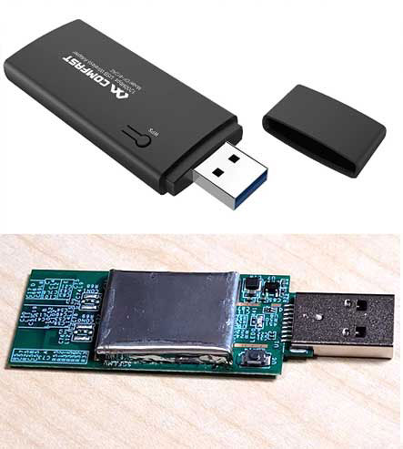


## Antenas

This 2.4Ghz antena seems to be the best choice for the UAV because it is flexible and can be mouted on the wing using part of cable tie or toothpick:


Various PCB antenas for 2.4Ghz can be considered (not tested):


The best choice for GS is pair of 5dBi dipoles or 5dbi dipole + BetaFPV Moxon Antenna.

It is important that all antenas should be mounded **VERTICALLY**.

**esp32cam** PCB antena can not provide range more then a few metters. 

Note: **esp32cam** board requires soldering resistor to use external antena: https://www.youtube.com/watch?v=aBTZuvg5sM8

Do not power wifi card or **ESP32** without antena attached; it can damage output amplifier.

# Dual Wifi Adapters

**hx-esp32-cam-fpv** supports dual Wifi adapters to decrease packet loss ratio. [Default launch script](https://github.com/RomanLut/hx-esp32-cam-fpv/blob/1e14550fcf04f8fcb10a3b6a18126332e7aa6609/gs/launch.sh#L20) will launch GS in dual adapters mode if **wlan1** and **wlan2** are found in the system.

## Range 

**2dbi dipole on plane, 5dbi dipoles on GS:** 1.2km at 24Mbps, 600m at 36Mbps (line of sight, away from wifi routers). Will drop to few metters with walls/trees on the way.

**2dbi dipole on plane, 5dbi dipole + BetaFPV Moxon Antenna on GS:** 2km at 24Mbps, 900m at 36Mbps.

Range is limited by **ESP32** output power (100mW 20dB) and highly depends on antena type and quality.

Tested on inav microplane: https://www.youtube.com/watch?v=GYB-UckucRA


# Drivers 

I am still searching for the best **RTL8812au** drivers for this project.

There are seems to be few choises:

  * Works fine on RPI0 2W, does not work on RPI4: https://github.com/morrownr/8812au-20210820  (https://github.com/morrownr/8812au)
  * Seems to work but does not report RSSI: https://github.com/svpcom/rtl8812au/tree/v5.2.20
  * Seems to work but RSSI seems to be reported 2x higher then real sometimes: https://github.com/svpcom/rtl8812au/tree/v5.2.20-rssi-fix-but-sometimes-crash
  * Does not work: https://github.com/aircrack-ng/rtl8812au

Proper drivers for **AR8271** are included in OS image already.

Note that some optimizations important for other open source digital FPV systems are not important for **hx-esp32-cam-fpv**. Wifi card is not used on air unit, so high output power and and high-bandwidth packet injection are not important.

## Latency

Latency ranges between 90–110 ms across all resolutions at both 30 and 50 fps. Technologically, the system is similar to HDZero in that it begins transmission without waiting for a full frame from the camera. However, the source of the current latency still needs to be investigated, as the expected range should be around 40–80 ms.

**Raspberry Pi Zero 2W** GS with 60Hz TV:

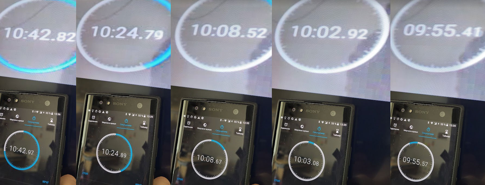

# Unsuccessfull attempts

## Attempt to use internal Rapsberry Pi Wifi card in monitor mode


**NEXMON** drivers https://github.com/seemoo-lab/nexmon offer monitor mode and packet injection for internal wifi card of Raspberry Pi. Original idea was to build extremely cheap ground station based on Raspberry Pi with internal antena replaced by dipole.

Unfortunatelly these attempts were unsuccessfull.

**NEXMON** drivers do support monitor mode and are used in Kali Linux builds for Rapsberry Pi. Unfortunatelly, to many packets are missed while listening for high-bandwidth stream. Packet injection barely works; few packets can be sent which  might be enough for wifi deauth, but not for sending data stream. Attempts to use packet injection crash the driver. Attempts to send packets lead to lossing 70% of incoming packets. Packet injection is disabled in the last builds of Kali Linux.

Even with external 2dBi dipole soldered properly, sensitivity is very bad. RSSI shows values 20dB less compared to rtl8812au card. In experimental single directional fpv system I was able to achieve ~20m transmission distance.

Additionally, there is a bug in the driver: if wifi hotspot which was associated last time is not available on boot, driver crashes on boot and wifi adapter is not available (a surpise on the field!).

Lesons learned: 

  - a wifi card with a good sensitivity and proper drivers with monitor mode and packet injection support is a key factor for successfull open source digital FPV system. So far only rtl8812au matches these criterias and is recommended choice.
  
  - you should aim for the best reception sensitivity possible on ground; GS should not be cheap. Air unit should be cheap - it can crash or fly away; GS is not.


## Using sensors with long flex cables


**esp32cam** can not rotate image and thus should be mounted vertically (vertical image flip is possible). Such form factor is not the best for a small plane.

Sensors can be bought with flex cables of various length.

Unfortunatelly attempt to use sensor with long flex cable was unsuccessfull. Flex cable wires cary high frequency (10Mhz) digital signals which produce a lot of RF noise. GPS sensor mounted in less then 7cm from **esp32cam** was jammed completely. Micro plane does not have a lot of space to separate GPS sensor from **esp32cam**. Even moved to the end of the wing (15cm away from **esp32cam**) it still barely found any satellites. **esp32cam** and flex cable shielding improved situation a little bit, but not enough to trust GPS sensor and try a range testing. 

**esp32cam** with long flex cable has been replaced with compact **esp32s3sense** board.

# Development

See [development.md](https://github.com/RomanLut/hx-esp32-cam-fpv/blob/master/doc/development.md)

# Original project

**esp32-cam-fpv** project was originally developed by **jeanlemotan** https://github.com/jeanlemotan/esp32-cam-fpv (currently seems to be abandoned). Some more work has been done by **Ncerzzk** https://github.com/Ncerzzk/esp-vtx who also seems to developed custom air unit hardware https://github.com/Ncerzzk/esp-vtx-hardware and continues to work on gs https://github.com/Ncerzzk/esp-vtx-gs-rs. 

The goal of this fork is to develop fpv system for small inav-based plane, starting from the prof-of-concept code of **jeanlemotan**.

# References

 * Getting Started with Seeed Studio XIAO ESP32S3 (Sense) https://wiki.seeedstudio.com/xiao_esp32s3_getting_started/ 


# FAQ

* Can  use Runcam VRX with tis project?
  No, Runcam VRX contains two **RLT8812EU** cards which support 5.8Ghz only.

* Can original **Raspberry Pi Zero W** be used as GS?
  
  No, RPI0W does not have enough performance to decode 800x600 MJPEG stream with it's CPU.

* Do I need to pair Air unit and GS?

  No, the ground station (GS) will automatically connect to any unpaired air unit detected on the selected Wi-Fi channel. Once connected, the air unit will communicate exclusively with that GS until it is rebooted. While multiple air unit/GS pairs can technically operate on the same channel, this is not recommended.

* What if packet lost and FEC can not recover?

  Then the whole frame is lost. That's why FEC is set to high redundancy by default.
