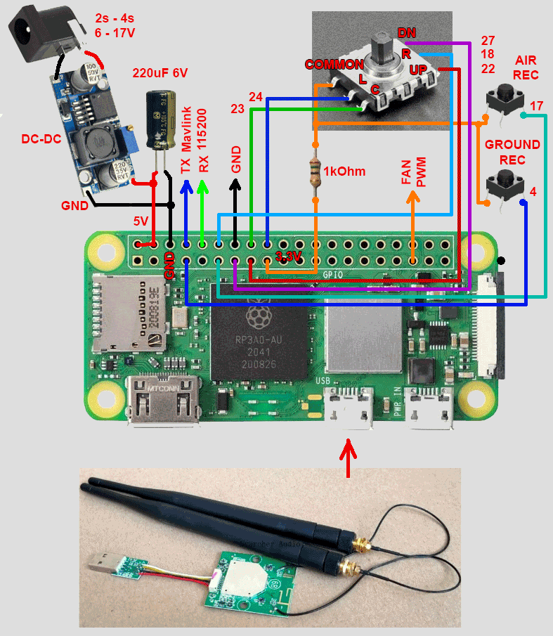
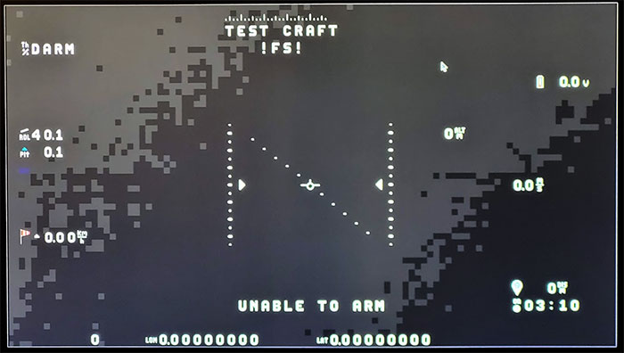
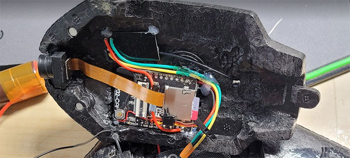

# esp32-cam-fpv
Open source digital FPV system based on esp32cam.
- [x] Fully functional video link
- [x] Mavlink RC
- [x] Displayport MSP OSD
- [x] GPIO Joystick
- [x] OSD Menu
- [x] documentation
- [ ] test ov5640 sensor
- [ ] release prebuilt images and firmware
- [ ] better diagnostic tools, investigate frame droping
- [ ] write proper format .mpg on air and ground

## Features:
- 640x480(4:3), 640x360(16:9), 800x600(4:3), 800x456(16:9) 30FPS 
- 1280x1024(4:3), 1280:720(16:9) 13fps on ov2640, 30fps on ov5640 with esp32s3
- up to 1km at 24mBit (line of sight)
- latency 10-30ms
- bidirectional Mavlink stream for RC and telemetry 115200 Kbps
- Displayport MSP OSD
- on-board and groundstation video recording

**Air unit variants:**
- **esp32cam** with **ov2640** camera
- **esp32s3sense** with **ov2640** camera
- **esp32s3sense** with **ov5640** camera

**Ground station:**
- **Raspberry Pi Zero 2W**(recommended) ... **Raspberry Pi 4B** with **rtl8812au**(recommended) or **AR9271** wifi card

## Original project

**esp32-cam-fpv** project was originally developed by **jeanlemotan** https://github.com/jeanlemotan/esp32-cam-fpv (currently seems to be abandoned). Some more work has been done by **Ncerzzk** https://github.com/Ncerzzk/esp-vtx who also seems to developed custom air unit hardware https://github.com/Ncerzzk/esp-vtx-hardware and continues to work on gs https://github.com/Ncerzzk/esp-vtx-gs-rs.

The goal of this fork is to develop fpv system for small inav-based plane.

# Theory
**ESP32** is too slow for video encoding. The data is received from the camera module as JPEG at 10MHz I2S clock (**ESP32**) or 20MHz (**ESP32S3**) and passed directly to the wifi and written to the SD card (if the DVR is enabled).

The **esp32-camera** component https://github.com/RomanLut/esp32-camera has been modified to send the data as it's received from the DMA instead of frame-by-frame basis. This decreases latency quite significantly (10-20 ms) and reduces the need to allocate full frames in PSRAM. **Ncerzzk** even removed PSRAM on his board. While frame is received from the camera, it is already in flight to GS.

The wifi data is sent using packet injection which is possible on **ESP32** platform. Data is sent with forward error correction encoding (FEC) which allows GS to recover lost packets. No acknowlegements are sent from GS and no retransmissions are done by air unit.

The air unit can also record the video straight from the camera to SD card. The format is a rudimentary MJPEG without any header so when playing back the FPS will be whatever your player will decide.

There is a significant buffering when writing to SD (3MB at the moment) to work around the very regular slowdowns of SD cards. The video quality of air unit recording is the same as on GS (no recompression is done).

The size of JPEG images vary a lot depending on number of details in the view. Adaptive JPEG compression level adjustment is implemented. Compression is adjusted to achieve frame sizes which fit into available bandwidth.

The receiver is a **Raspberry PI Zero 2W** ... **Pi4**  with **Realtek 8812au**(recommended) or **AR9271** adapter in monitor mode. Two wifi adapters may work as diversity receivers if required.

**8812au** with LNA is recommended, while PA is not that important. Range is limited by **ESP32** maximum output power of 100mW (20dB).

The JPEG decoding is done with turbojpeg to lower latency and - based on the resolution - can take between 1 and 7 milliseconds.

It's then uploaded to texture and shown on screen.

The link is bi-directional so the ground station can send data to the air unit. At the moment it sends camera and wifi configuration and bi-directional stream for telemetry (FEC encoded).

Here is a video shot at 30 FPS at 800x456 (video converted from the source mjpeg):

https://github.com/RomanLut/esp32-cam-fpv/assets/11955117/970a7ee9-467e-46fb-91a6-caa74871fc3b

# Is it worth building?

Do not expect a lot from this system. It all starts with a cheap camera (ov2640) comparable to 2005 smartphone cameras. With such camera you have to accept bad brightness/contrast against light, distorted colors, low light sensitivity, vignetting from cheap lenses, bad focus on corners, high jpeg compression artefacts etc. 

Secondly, esp32 is not capable of video encoding, which means that video stream is sent as a sequence of JPEG images, wasting bitrate which could be used to represent more details otherwise. 

Image looks Ok on 7” screen, but not more.

Let’s say honest: we expect at least HD resolution from the digital fpv system. All in all, **esp32-cam-fpv** competes with cheap analog 5.8 AIO camera, not with other digital fpv systems. It looses even against good analog system. Compared to analog AIO camera, **esp32-cam-fpv** offers air unit and ground station video recording, digital OSD, Mavlink stream, telemetry logging and absence of analog noise on image, for the same price. The downside is high JPEG compression, no WDR, distorted colors, low light sensitivity, varying quality of sensor and lenses, jerky framerate.

**esp32-cam-fpv** definitely looses againg all commecially available digital FPV systems.

The only benefits over other open-source systems (OpenHD/Ruby/OpenIPC) are: extremely low air unit price, tiny size (esp32s3sense), low latency, low power consumption (less then 300mA at 5V).

TODO: s3sense + ov5640 performance?

# Building

> [!NOTE]
> Please use **release** branch. **master** can be unstable.

## Air Unit

Flashing esp32cam firmware: [/doc/flashing_esp32_cam.md](/doc/flashing_esp32_cam.md)

**esp32cam**

esp32cam does not have enough free pins. Two configurations are available currently:

**Displayport MSP OSD + REC button**

**Displayport MSP OSD + Mavlink**

Both internal red LED and flash LED are used for indication:
 * solid - not recording
 * blinking 1Hz - recording
 * blinking 3Hz - OTA update mode.
 
Replace flash LED with small indication LED (Blue LED + 100 Ohm resistor), or remove, or paint with black marker.

**REC button** is used to start/stop air unit recording. Hold **REC button** on powerup to enter OTA (over the air update) mode.

With pcb antenna, 50m transmission distance can barely be achieved. A jumper has to be soldered to use external antena: https://www.youtube.com/watch?v=aBTZuvg5sM8

**es32s3sense**

 

 

 

Module comes with moderate flexible antenna which should be replaced with 2dBi dipole to maximize range.

Internal yellow LED conflicts with SD card and thus can not be used for indication. External LED should be soldered to pin **D0**.

Existing **Boot** button is used to start/stop air uint recording.

A jumper should be soldered on **J3** to enable SD card usage (somehow it works without it, but is required for stable operation):

## Current consumption

Both board consume less then 300mA. Flash LED on **esp32cam** board consumes 30mA itself.

## Ground Station

Building GS image : [/doc/building_gs_image.md](/doc/building_gs_image.md)

OSD for GPIO Joystick is not done yet; but REC buttons do work and Joystick lef/right changes resolution.

**TODO**

# Displayport MSP OSD

 Configure Displayport MSP OSD 115200, Avatar in INav/Betaflight/Ardupilot.
 
 

# Mavlink

 Can be used for RC and for downlink telemetry. Setup 115200 UART. 
 
 This is transparent bidirectional stream sent with FEC encoding.

# OSD Menu

OSD Menu can be navigated with **GPIO Joystick**, keyboard or mouse.

Key                                                    | Function
------------------------------------------------------ | -------------
Joystick Center, Enter, Right Click                    | Open OSD menu
Joystick Right, * REC, Esc, Right Click, R, G          | Close OSD Menu
Joystick Center, Joytsick Right, Enter, Left Click     | Select menu item
Joystick Up, Arrow Up                                  | Select previous menu item
Joystick Down, Arrow Down                              | Select next menu item
Joystick Left, Arrow Left, ESC                         | Exit to previous menu

# Debug interface

Toggle Debug interface with **D** or **Middle Click**.

# Joystick button mapping

GPIO Joystick and buttons are mapped to keys.

Key                   | Function
--------------------- | -------------
Joystick Center       | Enter
Joystick Left         | Arrow Left
Joystick Right        | Arrow Right
Joystick Up           | Arrow Up
Joystick Down         | Arrow Down
AIR REC               | r
GROUND REC            | g

# Other keys

Key                   | Function
--------------------- | -------------
Space                 | Exit application
ESC                   | Close OSD menu or exit application

# Considerations

## Resolution

**OV2640**

**esp32cam** and **esp32s3sence** boards come with the **OV2640** sensor by default. 

The sweet spot settings for this camera seems to be 800x600 resolution with JPEG compression level in range 8…63 (lower is better). 30 fps is achieved. Additionaly, custom 16:9 modes 640x360 and 800x456 are implemented. Personally I like 800x456 because 16:9 looks more "digital" :)

Another options are 640x480 and 640x356, which can have better JPEG compression level set per frame, but luck pixel details and thus do not benefit over 800x600.

Any resolution lower then 640x360, despite high frame rate (60fps with 320x240), is useless in my opinion due to luck of details.

**ov2640** can capture 1280x720 at 13 FPS. Image looks Ok, but FPS is definitely is lower then acceptable level. 

**OV5640**

**OV5640** supports the same resolutions and offers the same FPS thanks to binning support, but also have much better light sensivity, brightness and contrast. It also has higher pixel rate and supports 1280x720 30fps (which can be received by **esp32s3** only thanks to 2x maximum DMA speed).

**TODO: check ov5640 1280x720 36MBit performance**

## Lens 

Both **esp32cam** and **esp32s3sense** come with narrow lens which definitely should be replaced with wide angle 120 lens to be used on UAV.

Note that there are sensors with slightly different lens diameter. Two sensors on the left are compatible; the one on the right is not.

# Wifi channel

Default wifi channel is set to 7. 3…7 seems to be the best setting, because antennas are tuned for the middle range. F.e. in my experiments, channel 11 barely works with **AR9271** and **esp32s3sense** stock antenna.

## Wifi rate

24Mbps seems to be a sweet spot which provides high bandwidth and range. 

Lowering bandwidth to 12Mbps seems to not provide any range improvement; reception still drops at -83dB. 

Increasing bandwidth to 36Mbps allows to send less compressed frames, but decreases range to 600m. 36Mbps bandwidth is not fully used because practical maximum **ESP32** bandwidth seems to be 1.5 Mb/sec. Maximum SD write speed 1.2Mb/sec should also be considered here for the air unit DVR.

## Wifi interferrence 

Wifi channel is shared beetween multiple clients. In crowded area, bandwith can be significanly lower then expected. While tested on table at home, **esp32-cam-fpv** can show ~5FPS due to low bandwidth and high packet loss; this is normal.

Note than UAV in the air will sense carrier of all Wifi routers around and share wifi channel bandwidth with them (See **Carrier-sense multiple access with collision avoidance (CSMA/CA)** https://www.geeksforgeeks.org/carrier-sense-multiple-access-csma/ )

## DVR

Class 10 SD Card is required for the air unit. Maximum supported size is 32MB. Should be formatted to FAT32. The quality of recording is the same on air and ground; no recompression is done (obviously, GS recording does not contain lost frames).

**ESP32** can work with SD card in 4bit and 1bit mode. 1bit mode is chosen to free few pins. 4bit mode seems to provide little benefit (1.4Mb/sec write speed instead of 1.2Mb/sec).

## Adaptive quality

With the same JPEG compression level the size of a frame can vary a lot depending on scenery. Adaptive compressiong level is implemented to achieve best possible image quality.

Compression level can be set in range 1..63 (lower is better quality). However **ov2640** can return broken frames or crash with compression levels lower then 8. Also, decreasing compression level below 8 increases frame size but does not increase image much due to bad sensor quality itself.

Air unit calculates 3 coefficients which are used to adjust compression quality, where 8 is maximum and each coefficient can decrease it up to 63.

Theoretical maximum bandwidth of current Wifi rate is multipled by 0.7 (70%), divided by 2 (6/12 FEC redundancy) and divided by FPS. The result is target frame size.

Additionally, frame size is limited to safe 40Kb ( 40kb*30 FPS = 1.2Mb/sec).

Additionally, frame size is decreased if Wifi output queue grows (Wifi channel is shared between clients; practical bandwidth can be much lower then expected).

# FEC

Frames are sent using Forward error correction encoding. Currently FEC is set to 6/12 which means any 6 of 12 packets in block can be lost, but frame will be recovered.

FEC is set to such high redundancy because lost frame at 30 fps looks very bad, even worse then overal image quality decrease causes by wasted bandwidth.

Even with this settings and good connection frames are still lost sometimes, which is something which should investiaged further (**TODO** can redundancy be decreased?).

## Wifi card

This **RTL8812au** card is recommended for the project:

It can do high power output which is not important for **esp32cam-fpv**, but it comes with good 5dBi antenas which is the best purchase in summary.

Other cards should also work but not tested.

**AR9271** should also work but not tested. **RTL8812au** has antena diversity and thus is recommended over **AR9271**.

## Antenas

This 2.4Ghz antena seems to be the best choice for the UAV because it is flexible and can be mouted on the wing using part of cable tie or toothpick:

Various PCB antenas for 2.4Ghz can be considered (not tested):

The best choice for GS is 5dBi dipoles. 

It is important that all antenas should be mounded **VERTICALLY**.

**esp32cam** PCB antena can not provide range more the a few metters. **esp32cam** board requires soldering resistor to use external antena: https://www.youtube.com/watch?v=aBTZuvg5sM8

Do not power wifi card or **ESP32** without antena attached; it can damage output amplifier.

## Range 

1km at 24Mbps, 600m at 36Mbps (line of sight, away from wifi routers). Will drop to few metters with walls/trees on the way.

Range is limited by **ESP32** output power (100mW 20dB) and highly depends on antena type and quality.

Tested on inav microplane:

# Drivers 

I am still searching for the best **RTL8812au** drivers for this project.

There are seems to be few choises:

  * Works fine: https://github.com/morrownr/8812au-20210629
  * Works fine: https://github.com/morrownr/8812au-20210820
  * Seems to work but does not report RSSI: https://github.com/svpcom/rtl8812au/tree/v5.2.20
  * Seems to work but RSSI seems to be reported 2x higher then real: https://github.com/svpcom/rtl8812au/tree/v5.2.20-rssi-fix-but-sometimes-crash
  * Not tested: https://github.com/aircrack-ng/rtl8812au

Proper drivers for **AR8271** are included in OS image already.

Note that some optimizations important for other open source digital FPV systems are not important for **esp32-cam-fpv**. Wifi card is not used on air unit, so high output power and and high-bandwidth packet injection are not important.

## Latency

Latency is in range 10-30ms, for 640...1280 resolutions with both cameras (1280 30fps for ov5640). From technological side, this system is close to HD Zero which do not need to wait for the full frame from camera to start transmission. 

**Raspberry Pi Zero 2W** GS with 60Hz TV:

# Unsuccessfull attempts

## Attempt to use internal Rapsberry Pi Wifi card in monitor mode

**NEXMON** drivers https://github.com/seemoo-lab/nexmon offer monitor mode and packet injection for internal wifi card of Raspberry Pi. Original idea was to build extremely cheap ground station based on Raspberry Pi with internal antena replaced by dipople.

Unfortunatelly these attempts was unsuccessfull.

**NEXMON** drivers do support monitor mode and are used in Kali Linux builds for Rapsberry Pi. Unfortunatelly, to many packets are missed while listening for high-bandwidth stream. Packet injection barely works; few packets can be sent which  might be enough for wifi deauth, but not for sending data stream. Attempts to use packet injection crash the driver. Attempts to send packets lead to lossing 70% of incoming packets. Packet injection is disabled in the last builds of Kali Linux.

Even with external 2dBi dipole soldered properly, sensitivity is very bad. RSSI shows values 20dB less compared to rtl8812au card. In experimental single directional fpv system I was able to achieve ~20m transmission distance.

Additionally, there is a bug in the driver: if wifi hotspot which was associated last time is not available on boot, driver crashes on boot and wifi adapter is not available (a surpise on the field!).

Lesons learned: 

  - a wifi card with a good sensitivity and proper drivers with monitor mode and packet injection support is a key factor for successfull open source digital FPV system. So far only rtl8812au matches these criterias and is recommended choice.
  
  - you should aim for the best reception sensitivity possible on ground; GS should not be cheap. Air unit should be cheap - it can crash or fly away; GS is not.

## Using sensors with long flex cables

**esp32cam** can not rotate image and thus should be mounted vertically (vertical image flip is possible). Such form factor is not the best for a small plane.

Sensors can be bought with flex cables of various length.

Unfortunatelly attempt to use sensor with long flex cable was unsuccessfull. Flex cable wires cary high frequency (10Mhz) digital signals which produce a lot of RF noise. GPS sensor mounted in less then 7cm from **esp32cam** was jammed completely. Micro plane does not have a lot of space to separate GPS sensor from **esp32cam**. Even moved to the end of the wing (15cmaway from **esp32cam**) it still barely found any satellites. **esp32cam** and flex cable shielding improved situation a little bit, but not enough to trust GPS sensor and try a range testing. 

**esp32cam** with long flex cable has been replaced with compact **esp32s3sense** board.

# FAQ

* Can original **Raspberry Pi Zero W** be used as GS?
  
  No, RPI0W does not have enough performance to decode 800x600 MJPEG stream with it's CPU.

