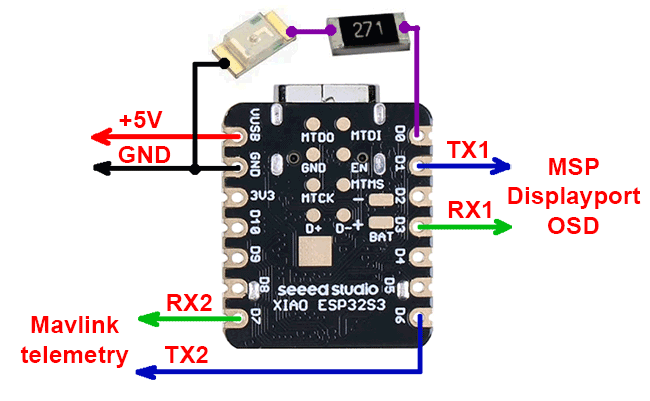
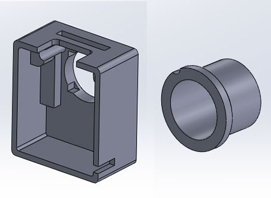
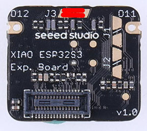
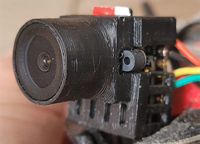
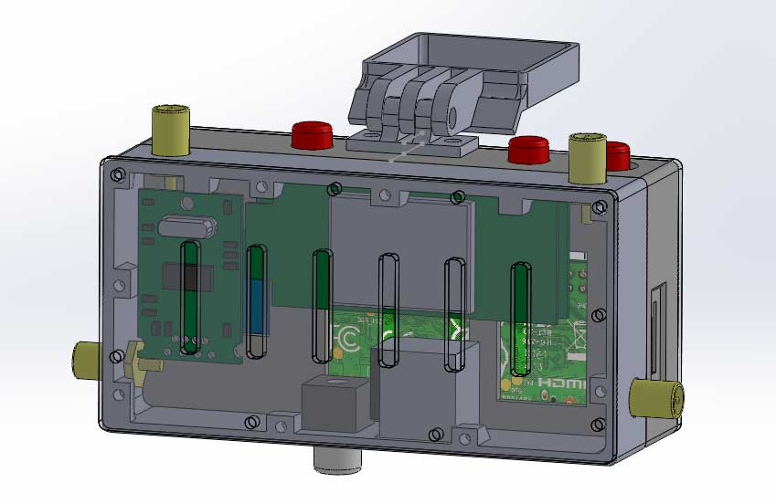
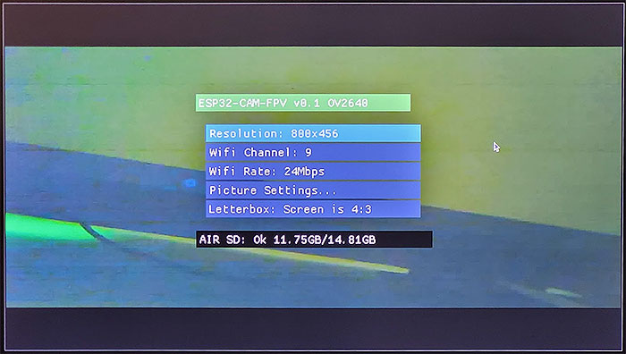
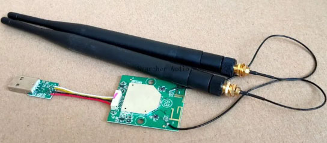
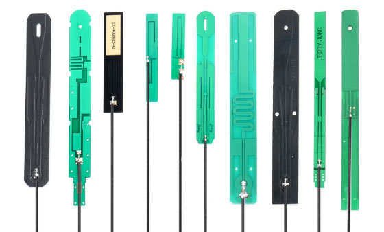
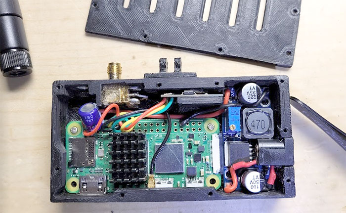

# hx-esp32-cam-fpv
Open source digital FPV system based on esp32cam.
- [x] Fully functional video link
- [x] Mavlink RC
- [x] Displayport MSP OSD
- [x] GPIO Joystick
- [x] OSD Menu
- [x] documentation
- [x] test ov5640 sensor
- [x] better diagnostic tools
- [x] write proper format .avi on air and ground (seek support)
- [x] font selection for Displayport OSD
- [x] air unit channel search
- [x] test dual wifi cards performance
- [x] build dual wifi RPI GS
- [x] release prebuilt images and firmware
- [ ] HQ DVR mode: 1280x720x30fps recording with maximum quality on air unit, with low framerate transmission to GS
- [ ] radxa 3w GS
- [ ] Camera OSD elements position configuration
- [ ] telemetry logging
- [ ] telemetry sharing on RPI Bluetooth
- [ ] sound recording (esp32s3sense)?
- [ ] difital pan, zoom
- [ ] fisheye correction shader, vignetting correction shader
- [ ] pairing
- [ ] EIS
- [ ] Android GS
- [ ] Meta Quest 2 GS

## Features:
- **ov2640**: 640x360 30fps, 640x480 30fps, 800x456 30fps, 800x600 30fps, 1024x576 13fps, 1280x720 13fps+
- **ov2640 with overclocking**: 640x360 40fps, 640x480 40fps, 800x456 40fps
- **esp32s3 + ov5640**: 640x360 50fps, 640x480 40fps, 800x456 50fps, 1024x576 30fps, 1280x720 30fps 
- up to 1km at 24Mbps, 600m at 36Mbps (line of sight)
- latency 10-30ms
- bidirectional stream for RC and telemetry 115200 Kbps (for Mavlink etc.)
- Displayport MSP OSD
- on-board and groundstation video recording

**Air unit variants:**
- **esp32cam** with **ov2640** camera
- **esp32s3sense** with **ov2640** camera
- **esp32s3sense** with **ov5640** camera _(recommended for FPV: has 50fps modes)_

**Ground station:**
- **Raspberry Pi Zero 2W**(recommended) ... **Raspberry Pi 4B** with **rtl8812au**(recommended) or **AR9271** wifi card. Dual **rtl8812au** are recommended for FPV.
  


## Original project

**esp32-cam-fpv** project was originally developed by **jeanlemotan** https://github.com/jeanlemotan/esp32-cam-fpv (currently seems to be abandoned). Some more work has been done by **Ncerzzk** https://github.com/Ncerzzk/esp-vtx who also seems to developed custom air unit hardware https://github.com/Ncerzzk/esp-vtx-hardware and continues to work on gs https://github.com/Ncerzzk/esp-vtx-gs-rs. 

The goal of this fork is to develop fpv system for small inav-based plane, starting from the prof-of-concept code of **jeanlemotan**.

# Theory
**ESP32** is too slow for video encoding. The data is received from the camera module as JPEG at 10MHz I2S clock (**ESP32**) or 20MHz (**ESP32S3** + **ov5640**) and is passed directly to the wifi and written to the SD card (if the DVR is enabled).

The **esp32-camera** component https://github.com/RomanLut/esp32-camera has been modified to send the data as it's received from the DMA instead of frame-by-frame basis. This decreases latency quite significantly (10-20 ms) and reduces the need to allocate full frames in PSRAM. **Ncerzzk** even removed PSRAM on his board. While frame is received from the camera, it is already in flight to GS.

The wifi data is sent using packet injection which is possible on **ESP32** platform. Data is sent with forward error correction encoding (FEC) which allows GS to recover lost packets. No acknowlegements are sent from GS and no retransmissions are done by air unit.

The air unit can also record the video straight from the camera to the SD card. There is a significant buffering when writing to SD (3MB at the moment) to work around the very regular slowdowns of SD cards. The video quality of air unit recording is the same as on GS (no recompression is done).

The size of JPEG images vary a lot depending on number of details in the view. Adaptive JPEG compression level adjustment is implemented. Compression is adjusted to achieve frame sizes which fit into available bandwidth.

The receiver is a **Raspberry PI Zero 2W** ... **Pi4**  with **Realtek 8812au**(recommended) or **AR9271** adapter in monitor mode. Two wifi adapters may work as diversity receivers if required.

**8812au** with LNA is recommended, while PA is not that important. Range is limited by **ESP32** maximum output power of 100mW (20dB).

The JPEG decoding is done with turbojpeg to lower latency and - based on the resolution - can take between 1 and 7 milliseconds.

It's then uploaded to texture and shown on screen.

The link is bi-directional so the ground station can send data to the air unit. At the moment it sends camera and wifi configuration and bi-directional stream for telemetry (FEC encoded).

Here is a video shot at 30 FPS at 800x456 with ov2640 sensor with 120 degeee lens:

https://github.com/RomanLut/esp32-cam-fpv/assets/11955117/970a7ee9-467e-46fb-91a6-caa74871fc3b

# Is it worth building?

Do not expect a lot from this system. It all starts with a cheap camera (ov2640) comparable to 2005 smartphone cameras. With such camera you have to accept noisy sensor, bad brightness/contrast against light, distorted colors, low light sensitivity, vignetting from cheap lenses, bad focus on corners, high jpeg compression artefacts etc. 

Secondly, esp32 is not capable of video encoding, which means that video stream is sent as a sequence of JPEG images, wasting bitrate which could be used to represent more details otherwise. 

Due to low resolution, **esp32-cam-fpv** competes with cheap analog 5.8 AIO camera, not with other digital fpv systems. 

Compared to analog AIO camera, **hx-esp32-cam-fpv** offers for the same price:
 - air unit and ground station video recording
 - digital OSD
 - Mavlink telemetry and RC
 - telemetry logging
 - absence of analog noise on image
 
The downside is high JPEG compression, no WDR, distorted colors, low light sensitivity, varying quality of sensor and lenses, frame droping.

For FPV flight with glasses, a setup with **esp32s3sense + ov5640** with dual Wifi adapters is recommended. Frame droping is not comfortable for FPV. **esp32s3sense + ov5640** offers 50Fps modes while dual adapters offer lower packet loss/frame loss ratio.

**hx-esp32-cam-fpv** definitely looses againg all commercially available digital FPV systems in terms of image quality.

The benefits over other open-source systems (OpenHD/Ruby/OpenIPC) are: 
- minimal air unit price
- tiny air unit size (esp32s3sense)
- low latency (actually a winner for the moment!)
- low power consumption (less then 300mA at 5V)
- **ground station hardware used for other fpv systems can be reused for hx-esp32cam-fpv project, just with different SD card inserted**

# Building

> [!NOTE]
> Please use **release** branch. **master** can be unstable.

## Air Unit

## esp32cam

Flashing esp32cam firmware: [/doc/flashing_esp32_cam.md](/doc/flashing_esp32_cam.md)

**esp32cam** does not have enough free pins. Two configurations are available currently.
Configuration is selected in [main.h](https://github.com/RomanLut/esp32-cam-fpv/blob/b63eb884e7c1e2ced3711dce53f20f102a39b4fc/components/air/main.h#L12) before building air unit firmware.

## Air Unit Variant 1: Displayport MSP OSD + REC button


## Air Unit Variant 2: Displayport MSP OSD + Mavlink


Both internal red LED and flash LED are used for indication:
 * solid - not recording
 * blinking 1Hz - recording
 * blinking 3Hz - OTA update mode.
 
Replace flash LED with small indication LED (Blue LED + 100 Ohm resistor), or remove, or paint with black marker:


**REC button** is used to start/stop air unit recording. Hold **REC button** on powerup to enter OTA (over the air update) mode.

With pcb antenna, 50m transmission distance can barely be achieved. A jumper has to be soldered to use external antena: https://www.youtube.com/watch?v=aBTZuvg5sM8

## esp32s3sense

Flashing esp32s3sense firmware: [/doc/flashing_esp32s3sense.md](/doc/flashing_esp32s3sense.md)

## Air Unit Variant 3: esp32s3sense + ov2640

STL files for 3D Printing on Thingiverse: https://www.thingiverse.com/thing:6624598



 

 

 

Module comes with moderate flexible antenna which should be replaced with 2dBi dipole to maximize range.

Internal yellow LED conflicts with SD card and thus can not be used for indication. External LED should be soldered to pin **D0**.

Existing **Boot** button is used to start/stop air unit recording.

A jumper should be soldered on **J3** to enable SD card usage (somehow it works without it, but is required for stable operation).

## Air Unit Variant 4: esp32s3sense + ov5640

 

**ov5640** on **esp32s3sense** camera offers 640x360 50fps, 640x480 40fps, 800x456 50fps, 1024x576 30fps and 1280x720 30fps modes, less noisy sensor, much beter colors and contrast, good performance against sunlight.

**es32s3sense** boards are sold with **ov2640** camera which can be easily replaced with **ov5640** purchased separately.

800x456 30fps 26Mbit with ov5640 camera 160 degree lens:

https://github.com/RomanLut/hx-esp32-cam-fpv/assets/11955117/3abe7b94-f14d-45f1-8d33-997f12b7d9aa


STL files for 3D Printing 14mm lens shell on Thingiverse: https://www.thingiverse.com/thing:6646566

## Current consumption

Both **esp32cam** and **esp32s3sense** consume less then 300mA. Flash LED on **esp32cam** board consumes 30mA itself.

## Ground Station

Preparing SD Card for GS from pre-built image: [/doc/building_gs_image.md](/doc/prebuilt_gs_image.md)

Or building GS image : [/doc/building_gs_image.md](/doc/building_gs_image.md)

STL files for 3D printing enclosure on Thingiverse: https://www.thingiverse.com/thing:6624580

## Ground Station Variant 1: Single rtl8812au

Single wifi card is Ok for GS with LCD monitor.


## Ground Station Variant 2: Dual rtl8812au

Dual wifi cards variant benefit less frame dropping.





A small USB 2.0 hub board is used to connect two wifi cards and add two USB port sockets. 

Small rtl8812au cards are used. AV output is reserved for future use.


Note that red/black antenas are not recommented unless all you want is to look cool :) These are 2dbi wideband antenas. A pair of 2.4Ghz BetaFPS Moxons with 90 degree adapters are recommended instead.


# Displayport MSP OSD

 Configure Displayport MSP OSD 115200, Avatar in INav/Betaflight/Ardupilot.

 A number of OSD fonts are included. User fonts can be placed in ```/gs/assets/osd_fonts/``` - 24 pixels wide png format.
 
https://github.com/RomanLut/hx-esp32-cam-fpv/assets/11955117/42821eb8-5996-4f39-aac6-2929c9d3661e


# Mavlink

 Can be used for RC and for downlink telemetry. Setup 115200 UART. 
 
 This is transparent bidirectional stream sent with FEC encoding (Groun2Air: ```k=2 n=3```, Air2Ground: Same as video stream, ```k=6 n=12``` by default).

# Camera OSD Elements


From left to right:
 - RSSI in Dbm
 - Average wifi queue usage. Should be below 50%. Look for free wifi channel if it turns red constantly
 - actual MJPEG stream bandwidth in Mbps (without FEC encoding). Wifi stream bandwwith = MJPEG stream bandwidth * FEC_n / FEC_k
 - resolution
 - FPS
 - ```!NO PING!``` Indicates that air unit does not receive GS packets (configuration packets, uplink Mavlink)
 - ```AIR``` Air unit is recording video to SD card
 - ```GS``` GS is recording video to SD card
 - ```!SD SLOW!``` SD card on AIR unit is too slow to record video, frames are skipped

# OSD Menu



OSD Menu can be navigated with **GPIO Joystick**, keyboard or mouse.

Key                                                    | Function
------------------------------------------------------ | -------------
Joystick Center, Enter, Right Click                    | Open OSD menu
Joystick Right, Air REC, GS REC,Esc, Right Click, R, G | Close OSD Menu
Joystick Center, Joytsick Right, Enter, Left Click     | Select menu item
Joystick Up, Arrow Up                                  | Select previous menu item
Joystick Down, Arrow Down                              | Select next menu item
Joystick Left, Arrow Left, ESC                         | Exit to previous menu

# GPIO Joystick button mapping

GPIO Joystick and buttons are mapped to keys.

Key                   | Function
--------------------- | -------------
Joystick Center       | Enter
Joystick Left         | Arrow Left
Joystick Right        | Arrow Right
Joystick Up           | Arrow Up
Joystick Down         | Arrow Down
AIR REC               | r
GROUND REC            | g


# Other keys

Key                   | Function
--------------------- | -------------
Space                 | Exit application
ESC                   | Close OSD menu or exit application
d                     | Open Development UI


# Considerations

## Resolution

**OV2640**

**esp32cam** and **esp32s3sence** boards come with the **OV2640** sensor by default. 

The sweet spot settings for this camera seems to be 800x600 resolution with JPEG compression level in range 8…63 (lower is better quality). 30 fps is achieved. Additionaly, custom 16:9 modes 640x360 and 800x456 are implemented. Personally I like 800x456 because 16:9 looks more "digital" :)

Another options are 640x480 and 640x360, which can have better JPEG compression level set per frame, but luck pixel details and thus do not benefit over 800x456.

Any resolution lower then 640x360, despite high frame rate (60fps with 320x240), is useless in my opinion due to luck of details.

**ov2640** can capture 1280x720 at 13 FPS. Image looks Ok on 7" screen, but FPS is definitely is lower then acceptable level for FPV.

It is possible to overclock **ov2640** sensor in **Camera Settings** to enable 40Fps in 640x360, 640x480 and 800x456 modes, however it is not garantied to work. If it does not work - try with another sensor.

**ov2640** is Ok for day but has much worse light sensitivity and dynamic range compared to **ov5640** in the evening. This and next video are made in almost the same light conditions:

800x456 30fps 26Mbit with ov2640 camera 120 degree lens:

https://github.com/RomanLut/hx-esp32-cam-fpv/assets/11955117/9e3b3920-04c3-46fd-9e62-9f3c5c584a0d

**OV5640**

**OV5640** supports the same resolutions and offers the same FPS thanks to binning support, but also have much better light sensivity, brightness and contrast. It also has higher pixel rate and supports 1280x720 30fps (which can be received by **esp32s3** thanks to 2x maximum DMA speed).

800x456 image looks much better on **ov5640** compared to **ov2640** thanks to highger sensor quality and less noise.

However, 1280x720 30fps requres too high bandwidth, so system has to set high compression levels which elliminates detais. Overall, 1024x576 30fps looks better. Both modes require 36Mbps+ wifi rate to provide benefits over 800x456.

It is possible to enable 50Fps 640x360 and 800x456 modes is **Camera Settings**. These modes are the best choise for FPV. Unfortunatelly, camera seems to distort colors in low light conditions in these modes (flying in the evening).

While **ov5640** can do 50Fps in higher resolution modes, it does not make a sense to use them because higher FPS requires too high bandwidth for MJPEG stream. 

**Note: ov5640** does not support **vertical image flip**.

800x456 30fps 26Mbit with ov5640 camera 160 degree lens:

https://github.com/RomanLut/hx-esp32-cam-fpv/assets/11955117/cbc4af6c-e31f-45cf-9bb4-2e1dd850a5d8

## Lens 


Both **esp32cam** and **esp32s3sense** come with narrow lens which definitely should be replaced with wide angle 120 or 160 lens to be used on UAV.

Note that there are sensors with slightly different lens diameter. Two sensors on the left are compatible; the one on the right is not.

Note that "night version" sensor does not have IR filter and shows distorted colors under sunlight (buy a proper sensor!).

# Wifi channel

Default wifi channel is set to 7. 3…7 seems to be the best setting, because antennas are tuned for the middle range. F.e. in my experiments, channel 11 barely works with **AR9271** and **esp32s3sense** stock antenna. In the crowded wifi environment, best channel is the one not used by other devices. System may not be able to push frames on busy channel at all (high wifi queue usage will be shown on OSD).

## Wifi rate

24Mbps seems to be a sweet spot which provides high bandwidth and range. 

Lowering bandwidth to 12Mbps seems to not provide any range improvement; reception still drops at -83dB. 

Increasing bandwidth to 36Mbps allows to send less compressed frames, but decreases range to 600m. 36Mbps bandwidth is not fully used because practical maximum **ESP32** bandwidth seems to be 2.3 Mb/sec. Maximum SD write speed 1.2Mb/sec (esp32) and 1.6Mb/sec (esp32s3) should also be considered here for the air unit DVR.

## Wifi interferrence 

Wifi channel is shared beetween multiple clients. In crowded area, bandwith can be significanly lower then expected. While tested on table at home, **hx-esp32-cam-fpv** can show ~5FPS due to low bandwidth and high packet loss; this is normal.

Note than UAV in the air will sense carrier of all Wifi routers around and share wifi channel bandwidth with them (See [Carrier-sense multiple access with collision avoidance (CSMA/CA)](https://www.geeksforgeeks.org/carrier-sense-multiple-access-csma/) )

## DVR

Class 10 SD Card is required for the air unit. Maximum supported size is 32MB. Should be formatted to FAT32. The quality of recording is the same on air and ground; no recompression is done (obviously, GS recording does not contain lost frames).

**ESP32** can work with SD card in 4bit and 1bit mode. 1bit mode is chosen to free few pins. 4bit mode seems to provide little benefit (30% faster with 4 bit). Overal, 1.9Mb/sec in 1 bit mode is more then Wifi can transfer, for SD writing speed is not a limiting factor for now.

## Adaptive compression

With the same JPEG compression level the size of a frame can vary a lot depending on scenery. A lot means order of 5 or more. Adaptive compression is implemented to achieve best possible image quality.

For **ov2640** sensor, compression level can be set in range 1..63 (lower is better quality). However **ov2640** can return broken frames or crash with compression levels lower then 8. Also, decreasing compression level below 8 increases frame size but does not increase image quality much due to bad sensor quality itself. System uses range 8...63.

Frame data flows throught a number of queues, which can easily be overloaded due to small RAM size on ESP32, see [profiling](https://github.com/RomanLut/hx-esp32-cam-fpv/blob/master/doc/development.md#profiling).

Air unit calculates 3 coefficients which are used to adjust compression quality, where 8 is minumum compressoin level and each coefficient can increase it up to 63.

Theoretical maximum bandwidth of current Wifi rate is multipled by 0.5 (50%), divided by FEC redundancy (**/FEC_n * FEC_k**) and divided by FPS. The result is target frame size.

Additionally, compression level is limited by maximum SD write speed when air unit DVR is enabled; it is 1.9MB/sec frame data for **ESP32/esp32s3sense**. 

Additionally, frame size is decreased if Wifi output queue grows (Wifi channel is shared between clients; practical bandwidth can be much lower then expected). **This is the most limiting factor**.

Adaptive compression is key component of **hx-esp32-cam-fpv**. Without adaptive compression, compression level have to be set to so low quality, that system became unusable.

# FEC

Frames are sent using Forward error correction encoding. Currently FEC is set to k=6, n=12 which means that bandwidth is doubled but any 6 of 12 packets in block can be lost, and frame will still be recovered. It can be changed to 6/8 or 6/10 in OSD menu.

FEC is set to such high redundancy because lost frame at 30 fps looks very bad, even worse then overal image quality decrease caused by wasted bandwidth.

## Wifi card

This **RTL8812au** card is recommended for the project:



It can do high power output which is not important for **esp32cam-fpv**, but it comes with good 5dBi antenas which is the best purchase in summary.

Other cards should also work but not tested.

**AR9271** should also work but not tested. **RTL8812au** has antena diversity and thus is recommended over **AR9271**.

## Antenas

This 2.4Ghz antena seems to be the best choice for the UAV because it is flexible and can be mouted on the wing using part of cable tie or toothpick:


Various PCB antenas for 2.4Ghz can be considered (not tested):



The best choice for GS is pair of 5dBi dipoles or 5dbi dipole + BetaFPV Moxon Antenna.

It is important that all antenas should be mounded **VERTICALLY**.

**esp32cam** PCB antena can not provide range more then a few metters. 

Note: **esp32cam** board requires soldering resistor to use external antena: https://www.youtube.com/watch?v=aBTZuvg5sM8

Do not power wifi card or **ESP32** without antena attached; it can damage output amplifier.

# Dual Wifi Adapters

**hx-esp32-cam-fpv** supports dual Wifi adapters to decrease packet loss ratio. [Default launch script](https://github.com/RomanLut/hx-esp32-cam-fpv/blob/1e14550fcf04f8fcb10a3b6a18126332e7aa6609/gs/launch.sh#L20) will launch GS in dual adapters mode if **wlan1** and **wlan2** are found in the system.

## Range 

**2dbi dipole on plane, 5dbi dipoles on GS:** 1.2km at 24Mbps, 600m at 36Mbps (line of sight, away from wifi routers). Will drop to few metters with walls/trees on the way.

**2dbi dipole on plane, 5dbi dipole + BetaFPV Moxon Antenna on GS:** 2km at 24Mbps, 900m at 36Mbps.

Range is limited by **ESP32** output power (100mW 20dB) and highly depends on antena type and quality.

Tested on inav microplane: https://www.youtube.com/watch?v=GYB-UckucRA


# Drivers 

I am still searching for the best **RTL8812au** drivers for this project.

There are seems to be few choises:

  * Works fine on RPI0 2W, does not work on RPI4: https://github.com/morrownr/8812au-20210629
  * Works fine on RPI0 2W, does not work on RPI4: https://github.com/morrownr/8812au-20210820
  * Seems to work but does not report RSSI: https://github.com/svpcom/rtl8812au/tree/v5.2.20
  * Seems to work but RSSI seems to be reported 2x higher then real sometimes: https://github.com/svpcom/rtl8812au/tree/v5.2.20-rssi-fix-but-sometimes-crash
  * Does not work: https://github.com/aircrack-ng/rtl8812au

Proper drivers for **AR8271** are included in OS image already.

Note that some optimizations important for other open source digital FPV systems are not important for **hx-esp32-cam-fpv**. Wifi card is not used on air unit, so high output power and and high-bandwidth packet injection are not important.

## Latency

Latency is in range 10-30ms for all resolutions at 30fps. From technological side, this system is close to HD Zero which do not need to wait for the full frame from camera to start transmission. 

**Raspberry Pi Zero 2W** GS with 60Hz TV:


# Unsuccessfull attempts

## Attempt to use internal Rapsberry Pi Wifi card in monitor mode



**NEXMON** drivers https://github.com/seemoo-lab/nexmon offer monitor mode and packet injection for internal wifi card of Raspberry Pi. Original idea was to build extremely cheap ground station based on Raspberry Pi with internal antena replaced by dipole.

Unfortunatelly these attempts were unsuccessfull.

**NEXMON** drivers do support monitor mode and are used in Kali Linux builds for Rapsberry Pi. Unfortunatelly, to many packets are missed while listening for high-bandwidth stream. Packet injection barely works; few packets can be sent which  might be enough for wifi deauth, but not for sending data stream. Attempts to use packet injection crash the driver. Attempts to send packets lead to lossing 70% of incoming packets. Packet injection is disabled in the last builds of Kali Linux.

Even with external 2dBi dipole soldered properly, sensitivity is very bad. RSSI shows values 20dB less compared to rtl8812au card. In experimental single directional fpv system I was able to achieve ~20m transmission distance.

Additionally, there is a bug in the driver: if wifi hotspot which was associated last time is not available on boot, driver crashes on boot and wifi adapter is not available (a surpise on the field!).

Lesons learned: 

  - a wifi card with a good sensitivity and proper drivers with monitor mode and packet injection support is a key factor for successfull open source digital FPV system. So far only rtl8812au matches these criterias and is recommended choice.
  
  - you should aim for the best reception sensitivity possible on ground; GS should not be cheap. Air unit should be cheap - it can crash or fly away; GS is not.


## Using sensors with long flex cables


**esp32cam** can not rotate image and thus should be mounted vertically (vertical image flip is possible). Such form factor is not the best for a small plane.

Sensors can be bought with flex cables of various length.

Unfortunatelly attempt to use sensor with long flex cable was unsuccessfull. Flex cable wires cary high frequency (10Mhz) digital signals which produce a lot of RF noise. GPS sensor mounted in less then 7cm from **esp32cam** was jammed completely. Micro plane does not have a lot of space to separate GPS sensor from **esp32cam**. Even moved to the end of the wing (15cm away from **esp32cam**) it still barely found any satellites. **esp32cam** and flex cable shielding improved situation a little bit, but not enough to trust GPS sensor and try a range testing. 

**esp32cam** with long flex cable has been replaced with compact **esp32s3sense** board.

# Development

See [development.md](https://github.com/RomanLut/hx-esp32-cam-fpv/blob/master/doc/development.md)

# FAQ

* Can original **Raspberry Pi Zero W** be used as GS?
  
  No, RPI0W does not have enough performance to decode 800x600 MJPEG stream with it's CPU.

* Do I need to pair Air unit and GS?

  Currently there is no pairing procedure; GS will receive signal from any air unit. As project is in early development state, it is assumed that there are single Air Unit and single GS in the area. If you ever try to test multiple systems, make sure channels are separated at least by 3, so that GS will not hear other air unit.

* What if packet lost and FEC can not recover?

  Then the whole frame is lost. That's why FEC is set to high redundancy by default.
