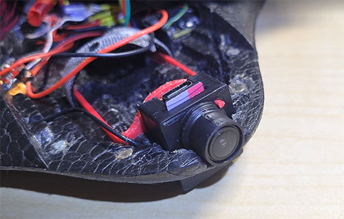
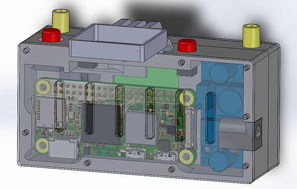
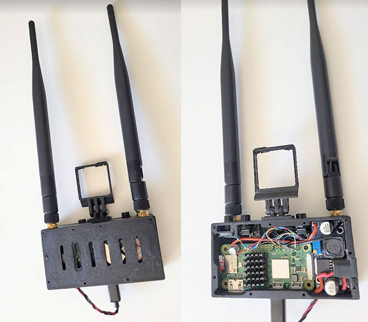

# **WORK IN PROGRESS!!!!**

# esp32-cam-fpv
Open source digital FPV system based on esp32cam.

## Features:
- 640x480(4:3), 640x360(16:9), 800x600(4:3), 800x456(16:9) 30FPS 
- 1280x1024(4:3), 1280:720(16:9) 13fps on ov2640, 30fps on ov5640 with esp32s3
- up to 1km at 24mBit (line of sight)
- latency 10-30ms
- bidirectional Mavlink stream for RC and telemetry 115200KBit
- Displayport MSP OSD
- on-board and groundstation video recording

**Air units variants:**
- esp32cam board with ov2640 camera
- esp32s3sense with ov2640 camera
- esp32s3sense with ov5640 camera

**Ground station:**
- Raspberry Pi Zero 2W ... Raspberry Pi 4B with rtl8812au or AR9271 wifi card

## Original project

**esp32-cam-fpv** project was originally developed by **jeanlemotan** https://github.com/jeanlemotan/esp32-cam-fpv (currently seems to be abandoned). Some more work has been done by **Ncerzzk** https://github.com/Ncerzzk/esp-vtx who also seems to developed custom air unit hardware https://github.com/Ncerzzk/esp-vtx-hardware and continues to work on gs https://github.com/Ncerzzk/esp-vtx-gs-rs.

The goal of this fork is to develop fpv system for small inav-based plane.

# Theory
ESP32 is too slow for video encoding. The data is received from the camera module as JPEG at 10MHz I2S clock (ESP32) or 20MHz (ESP32S3) and passed directly to the wifi and written to the SD card (if the DVR is enabled).

The **ESP camera** component has been modified to send the data as it's received from the DMA instead of frame-by-frame basis. This decreases latency quite significantly (10-20 ms) and reduces the need to allocate full frames in PSRAM. **Ncerzzk** even removed PSRAM on his board. While frame is received from the camera, it is already in flight to GS.

The wifi data is send using packet injection which is possible on ESP32 platform. Data is sent with error correction encoding (FEC) wich allows GS to recover lost packets. No acknowlegements are sent from GS and no retransmissions are done by air unit.

The air unit can also record the video straight from the camera to a sd card. The format is a rudimentary MJPEG without any header so when playing back the FPS will be whatever your player will decide.

There is significant buffering when writing to SD (3MB at the moment) to work around the very regular slowdowns of sd cards. The quality of air unit recording is the same as on GS (no recompression is done).

The size of JPEG images vary a lot dependiong on number of details in view. Adaptive JPEG compression level adjustment is implemented. Compression is adjusted to achieve frame sizes which fit into available bandwidth.

The receiver is a Raspberry PI Zero 2W ... Pi4  with Realtek 8812au or AR9271 adapter in monitor mode. Two wifi adapters may work as diversity receivers if required.

The JPEG decoding is done with turbojpeg to lower latency and - based on the resolution - can take between 1 and 7 milliseconds.

It's then uploaded to texture and shown on screen.

The link is bi-directional so the ground station can send data to the air unit. At the moment it sends camera and wifi configuration and bi-directional stream for telemetry (FEC encoded).

Here is a video shot at 30 FPS at 800x600 (video converted from the source mjpeg):

https://user-images.githubusercontent.com/10252034/116135308-43c08c00-a6d1-11eb-99b9-9dbb106b6489.mp4

# Is it worth building?

Do not expect a lot from this system. It all starts with a cheap camera (ov2640) comparable to 2005 smartphone cameras. With such camera you have to accept bad brightness/contrast against light, distorted colors, low light sensitivity, vignetting from cheap lenses, bad focus on corners, high jpeg compression artefacts etc. 

Secondly, esp32 is not capable of video encoding, which means that video stream is sent as sequence of JPEG images, wasting bitrate which could be used to represent more details otherwise. 

Image looks Ok on 7” screen, but not more.

Let’s say honest: we expect at least HD resolution from a digital fpv system. All in all, esp32-cam-fpv competes with cheap analog 5.8 AIO camera, not with other digital fpv systems. It loose even against good analog system. Compared to analog AIO camera, esp32-cam-fpv offers air unit and ground station video recording, digital OSD, Mavlink stream, telemetry logging and absence of analog noise on image, for the same price. The downside is high JPEG compression, no WDR, distorted colors, low light sensitivity, varying quality of sensor and lenses, jerky framerate.

**esp32-cam-fpv** definitely looses againg all commecially available digital FPV system.

The only benefits over other open-source systems (OpenHD/Ruby/OpenIPC) are: extremely low air unit price, tiny size (esp32s3sense), low latency, low power consumption (less then 300mA at 5V).

TODO: s3sense + ov5640 performance?

# Building

## Air Unit

[/doc/flashing_esp32_cam.md](/doc/flashing_esp32_cam.md)

**esp32cam**

esp32cam does not have enogh free pins. Two configurations are available:

Mavlink + REC button

Mavlink + Displayport MSP OSD

Replace flash LED with small indication LED (Blue LED + 100Ohm resistor):

With pcb antenna, 50m transmission distance can barely be achieved. A jumper has to be soldered to use external 2dbi dipole usage. 

**es32s3sense**

Module comes with moderate flexible antenna which should be replaced with 2dbi dipole to maximize range.

## Current consumption

Both board consume less then 300mA.

**TODO**

## Ground Station

[/doc/building_gs_image.md](/doc/building_gs_image.md)

**TODO**

# Considerations

## Resolution

**OV2640**

**esp32cam** and **esp32s3sence** boards come with the **OV2640** sensor by default. 

The sweet spot settings for this camera seems to be 800x600 resolution with jpeg quality varying in range 8…63 (lower is better). 30 fps is achieved. Additionaly, custom 16:9 mode 800x456 is implemented. Personally I like 800x456 because 16:9 looks more "digital" :)

Another option is 640x480 and 640x356, which can have better JPEG compression level set per frame, but lucks pixel details and thus have not benefit over 800x600.

Any resolution lower then 640x356, despite high frame rate (60fps and 320x240), is useless in my opinion due to luck of details.

ov2640 can capture 1280x720 at 13 FPS. Image looks Ok, but FPS is definitely is lower then acceptable level. 

**OV5640**

**OV5640** supports the same resolutions and offers the same FPS thanks to binning support, but also have much better light sensivity, brightness and contrast. It also has higher pixel rate and supports 1280x720 30fps (which can be received by esp32s3 only thans to 2x maximum DMA speed).

**TODO: check ov5640 1280x720 performance**

## Lenses 

Both esp32cam and esp32s3sense come this narrow lenses which definitely should be replaced with wide angle 120 lenses to be used on UAV.

# Wifi channel

Default wifi channel is set to 7. 3…7 seems to be the best setting, because antennas are tuned for the middle range. F.e. in my experiments, channel 11 barely works with AR9271 and esp32s3sense stock antenna.

## Wifi rate

** TODO**

## DVR

Class 10 SD Card is required. Maimum size is 32MB. Should be formatted to FAT32.

 **todo**

## Adaptive quality

**todo**

## Range 

1km at 24MBit, 600m at 36MBit.

## Latency

Latency is in range 10-30ms, for 640...1280 resolutions with both cameras (1280 30fps for ov5640). From technological side, this system is close to HD Zero which do not need to wait for the full frame from camera to start transmission. 

Raspberry Pi Zero 2W GS with 60Hz TV:

# Unsuccessfull attempts

## Attempt to use internal Rapsberry Pi Wifi card in monitor mode

NEXMON drivers offer monitor and packet injection for internal wifi card of Raspberry Pi. Original idea was to build exremely cheap ground station based on Raspberry Pi with inernal antena replaced by dipople.

Unfortunatelly this attempts was unsuccessfull.

NEXMON drivers do support monitor mode and are used in Kali Linux builds for Rapsberry Pi. Unfortunatelly, to many packets are missed while listening for high-bandwidth stream. Packet injection barely works; few packets can be send which  might be enough for wifi death, but not for sending data stream. Attapts to use packet injection crash the driver. Attempts to send packet leads to lossing 70% of incoming packets.

Even with external 2dbi dipole soldered properly, sensitivity is very bad. RSSI shows values 20db less compared to rtl8812au card. In experimental single directional fpv system I was able to achieve ~20m transmission distance.

Additionally, the re is a bug in driver: if wifi hotspot which was associated last time is not available on boot, driver crashes on boot and wifi adaper is not available (bas surpise on the field!).

Lesons learned: 
- a wifi card with a good sensitivity and proper drivers with monitor mode and packet injection support is a key factor for successfull open source digital FPV system. So far only rtl8812au matches this creiteria and is recommended choise.
- you should aim for the best reception possible on ground; gs should not be cheap. Air unit should be cheap - it can crash of fly away; GS is not.

## Using sensors with long flex cables

esp32cam can not rotate camera image and thus should be mounted vertically (vertical image flip is possible). Such form factor is not the best for small plane.

Sensors can be bought with flex cables of various length.

Unfortunatelly attempt to use sensor with long flex cable was unsuccessfull. Flex cable wires cary high frequency (10Mhz) digital signals which produce a lot of RF noise. GPS sensor mounted in less then 7cm from esp32cam was jammed completely. Micro plane does not have a lot of space to separate GPS sensor from esp32cam. Even moved to the end of the wing (15cm) it still barely found any satellites. esp32cam and flex cable shielding improved situation a little bit, but not enough to trust GPS sensor and try a range testing. 

esp32cam with long flex cable has been replaced with compact esp32s3sense board.

# FAQ

* Can original raspberry pi zero W be used as GS? 
  No, RPI0W does not have enough performance to decode 800x600 MJPEG stream with it's CPU.

